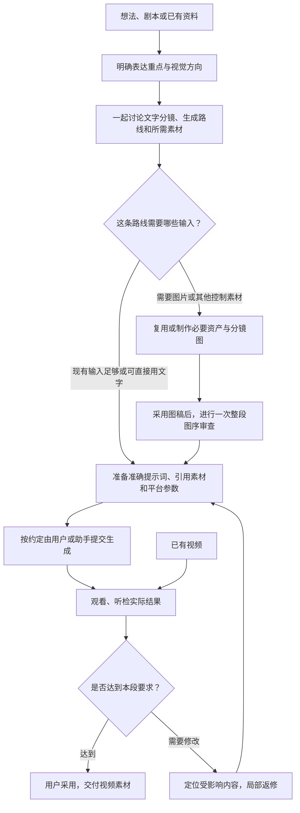

# 🎬 Cine AI Video Director

**把一个想法，逐步做成有明确拍法、可靠素材和生成提示词的 AI 视频。**

这是一个给 Codex 使用的创作 Skill，带有本地分镜工作台。你可以从一句想法开始，也可以带着剧本、图片或已有视频接着做。助手负责推敲故事和镜头、推荐模型与生成方式、准备素材和提示词；你在对话或工作台中选择方向、审阅结果，决定采用哪些内容。


[开始使用](#start) · [完整中文使用手册](docs/USAGE.md) · [工作台怎么用](docs/USAGE.md#workbench) · [当前版本](https://github.com/rickyk1z1/cine-ai-video-director/releases/tag/v3.2.0)

## 它帮你解决什么问题

做 AI 视频时，困难往往不只是“写一句提示词”：想法还没有变成观众能看懂的镜头，角色在不同图片里变了样，参考图限制了动作，或者做完一段才发现生成方式选错了。返修时，还容易把已经满意的内容一起推翻。

这个 Skill 把这些工作放在同一条制作链路里：

| 你遇到的情况 | 它会怎样协助 |
| --- | --- |
| 只有一个想法，材料不齐 | 先梳理表达重点和观看过程，提出可讨论的方案，再按需要补资料与素材 |
| 有剧本，但不知道怎么拍 | 设计镜头、动作、构图、运镜与衔接，说明每个镜头的作用 |
| 不知道该用什么模型、准备哪些图 | 在文字分镜阶段一起推荐生成路线、模型、平台和必要输入 |
| 画面好看，视频动作却僵硬 | 检查参考图的职责、动作因果和时间约束，围绕实际生成入口重写提示词 |
| 想改某一处，又怕全流程重来 | 只同步真正受影响的文字、图片或生成输入，保留其他已采用内容与制作进度 |
| 对话多了，找不清当前版本 | 工作台集中展示当前镜头、选择、素材、提示词与下一步，历史仍可回查 |

它交付的是**分镜、制作资产、生成输入和经过检查的视频素材**。后期剪辑、配乐、混音与成片包装需要另行安排；接入什么平台、是否由助手提交生成，也按你的实际工具和授权决定。

<a id="start"></a>
## 几分钟开始使用

当前仓库为私有仓库。你的 Git 需要有访问权限；安装需要 **Node.js 20+**，工作台需要 **Python 3.10+** 和浏览器。

```sh
npm exec --yes --package=github:rickyk1z1/cine-ai-video-director#v3.2.0 -- cine-ai-video-director
```

安装器会识别旧名 `cinematic-storyboard`，核对无本地修改后迁移为新名，保留原安装根；已有新名安装会直接更新。新安装默认放在 `~/.agents/skills/cine-ai-video-director`。如果发现多个现役副本，或无法判断文件是否经过本地修改，会保留原文件并说明原因。

安装后新开一个 Codex 对话；如果 Skill 尚未出现，重启 Codex。接下来直接描述需求即可：

> 用 cine-ai-video-director 帮我做一条短片。我只有一个想法：桌上的纸鸟慢慢活过来，飞出窗外。材料还没准备，请先和我推敲表达方式、视觉风格和拍法，再推荐生成路线。

你不必自己填写制作数据表。助手会根据当前需求建立或打开工作台。已有分镜或视频时，也可以直接说“继续这份分镜”或“只修这条视频的 8–12 秒”。需要自行启动页面，见[启动命令](docs/USAGE.md#commands)。

## 从想法到视频，怎样推进

下面是新作品的常见路径。已有材料可以直接从相应位置进入，实际不需要的环节可以跳过。



- **路线按内容选择。** H3、即梦 / Seedance、可灵是重点考虑的模型方向；小云雀、Higgsfield、TapNow 等属于执行平台的选择。具体能力以当时可用入口为准，一次选择不会永久锁定整个项目。
- **分镜数量不等于生成任务数量。** 可以一条视频包含多个镜头，也可以把困难的段落单独生成；是否需要首尾帧、多参考、运动参考或预演，由控制需求决定。
- **调整不等于退回重走。** 图稿完成后仍可改文字、动作或构图。助手同步实际受影响的输入，继续当前工作；新的重大取舍才需要再次讨论。
- **“准备好”与“生成完成”分开。** 写好节点不代表已经提交，拿到文件不代表已检查或已采用。

## 工作台：把当前方案摆在面前

工作台包含项目与协作、视觉定调、文字分镜、分镜所用资产和分镜预览等视图。创意参考是随时可用的辅助工具；它不会把你切换到另一个制作阶段。


你可以在页面中改镜头、选风格或选择推荐路线，也可以直接在对话里决定，两者记录到同一个项目。**页面显示保存成功后，回到对话说“继续”即可。** 页面不会自动给助手发送新消息；助手续做时读取当前选择，不要求你再确认一遍。

如果约定由你点击平台的生成按钮，助手会停在提示词、素材和节点检查完成的位置。“继续”不会自动改变这项分工。[查看工作台操作说明](docs/USAGE.md#workbench)。

## 你会得到什么

- 可讨论、可修改的文字分镜，以及镜头设计和生成路线的依据。
- 按实际需要准备的角色、场景、道具、分镜图或其他控制素材。
- 面向具体模型和平台的完整提示词、实际引用素材、参数与声音安排。
- 本地工作台、Markdown 阅览稿、制作记录，以及实际生成后登记的视频素材。

项目数据保存在你选择的本地项目目录中，Skill 本身保存方法与工具。基础工作台和内置视觉图鉴可离线运行；在线案例检索、图片或视频生成需要相应网络、工具与账号，平台费用另计。

## 分享给朋友

项目保持私有，仅分享给你在 GitHub 中邀请的协作者。朋友先用自己的 GitHub 账号取得访问权限，配置好 Git 登录后，即可使用上面的同一条 npm 命令安装。这里的 npm 用于下载和运行私有 GitHub 安装包，不代表项目已发布到公开 npm。

[查看邀请、登录、安装与更新步骤](docs/SHARING.md)。

## 继续阅读

| 文档 | 适合什么时候看 |
| --- | --- |
| [中文使用手册](docs/USAGE.md) | 第一次使用，想逐步了解每个阶段该做什么、如何继续 |
| [移植与运行条件](references/portability.md) | 换机器、配置环境、了解可选工具和验证范围 |
| [Skill 制作规则](SKILL.md) | 想了解助手如何判断、执行和处理例外 |
| [模型与生成策略](references/generation-strategy.md) | 想了解为什么推荐某种输入方式或生成分组 |
| [推进与修订规则](references/workflow-navigation.md) | 想了解局部修改怎样影响素材和下一步 |

当前版本 **3.2.0** 将项目统一命名为 **🎬 Cine AI Video Director**，支持旧名称安装迁移。原有模型路线规划、在线方法查询、工作台与局部修订流程保持不变。详细操作以手册和实际工作台为准。

本仓库保持私有。内置视觉图鉴保留[图片来源记录](assets/visual-style-atlas/atlas.json)，供有仓库访问权的成员参考；仓库访问权限不代表获得其中第三方图片的公开转载或再分发许可。
