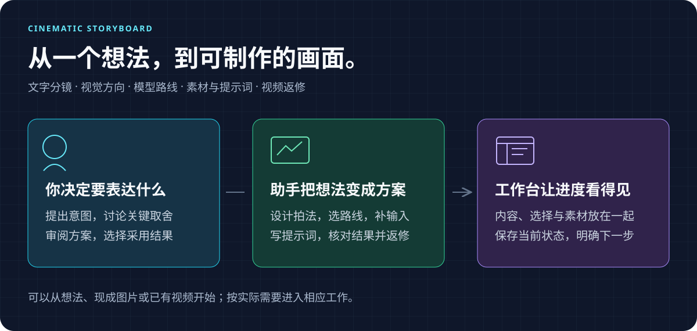
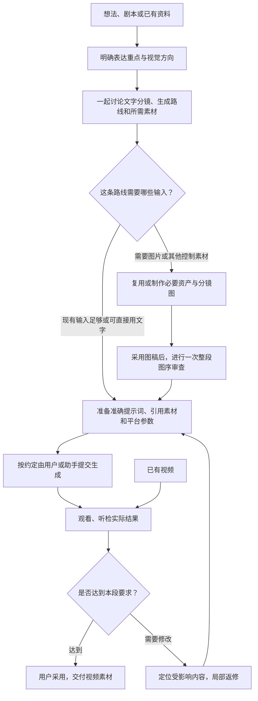

# 🎬 Cine AI Video Director

**把一个想法，逐步做成有明确拍法、可靠素材和生成提示词的 AI 视频。**

这是一个给 Codex 使用的创作 Skill，带有本地分镜工作台。你可以从一句想法开始，也可以带着剧本、图片或已有视频接着做。助手负责推敲故事和镜头、推荐模型与生成方式、准备素材和提示词；你在对话或工作台中选择方向、审阅结果，决定采用哪些内容。



[功能介绍](#features) · [开始使用](#start) · [完整中文使用手册](docs/USAGE.md) · [工作台怎么用](docs/USAGE.md#workbench) · [当前版本](https://github.com/rickyk1z1/cine-ai-video-director/releases/tag/v3.2.2)

## 它帮你解决什么问题

做 AI 视频时，困难往往不只是“写一句提示词”：想法还没有变成观众能看懂的镜头，角色在不同图片里变了样，参考图限制了动作，或者做完一段才发现生成方式选错了。返修时，还容易把已经满意的内容一起推翻。

这个 Skill 把这些工作放在同一条制作链路里：

| 你遇到的情况 | 它会怎样协助 |
| --- | --- |
| 只有一个想法，材料不齐 | 先梳理表达重点和观看过程，提出可讨论的方案，再按需要补资料与素材 |
| 有剧本，但不知道怎么拍 | 设计镜头、动作、构图、运镜与衔接，说明每个镜头的作用 |
| 不知道该用什么模型、准备哪些图 | 在文字分镜阶段一起推荐生成路线、模型、平台和必要输入 |
| 画面好看，视频动作却僵硬 | 检查参考图的职责、动作因果和时间约束，围绕实际生成入口重写提示词 |
| 想改某一处，又怕全流程重来 | 只同步真正受影响的文字、图片或生成输入，保留其他已采用内容与制作进度 |
| 对话多了，找不清当前版本 | 工作台集中展示当前镜头、选择、素材、提示词与下一步，历史仍可回查 |

它交付的是**分镜、制作资产、生成输入和经过检查的视频素材**。后期剪辑、配乐、混音与成片包装需要另行安排；接入什么平台、是否由助手提交生成，也按你的实际工具和授权决定。

<a id="features"></a>
## 它具体能做什么

### 和你一起把想法推敲成文字分镜

只有一句想法也能开始。它先讨论观众应该看见什么、信息怎样揭示、情绪怎样推进，再把内容组织成有目的的镜头。你可以比较“一镜到底”和“分镜切换”，也可以保留已有剧本，只调整拍法。

每个镜头会明确**内容与动作、景别与构图、机位与运镜、起止状态、前后衔接、预计时长、声音和所需资产**。它会说明为什么这样安排，指出真正影响表达的取舍；你提出修改后，直接同步相关镜头与素材，继续当前工作。

> 例如你说：“纸鸟活过来的过程太直白，想让观众先察觉异常，再看清它。”它可以先设计折痕轻微张合、纸面影子变化，随后揭示完整鸟形，再讨论是否需要切近景，以及这样改会影响哪些输入。

这类讨论先形成一个完整主方案。只有不同方向值得比较时才提供备选，不要求你先填完一套固定问卷。

### 看图比较，确定整条片子的视觉方向

内置视觉图鉴包含 **28 个方向、53 张本地参考图**，可以离线浏览、筛选、对比和保存。助手会结合题材推荐少量差异明显的方向，例如自然写实、绘本插画、风格化 3D、黏土定格感或拼贴混合媒介。

你可以分别确定呈现形式、具体画风与调性，再补充本片的色彩、光线和材质要求。保存的视觉方向会用于后续角色、场景、分镜图与提示词；已有明确风格时直接沿用。

### 在线捕获动效灵感，把“这种感觉”说清楚

当你难以描述某个运镜、转场、形态变化或节奏效果时，可以在任何阶段使用 **“找画面参考”**。助手围绕当前难点，在 Eyecandy、Stash、Frame Set、Good Moves、Motion Design Awards 等既定来源中寻找贴近的动态案例。

返回的不只是链接：还包括**该看哪段、它为什么贴近、与你这条片子的区别，以及可以借用的具体表现方法**。能取得真实可用的媒体地址时可在工作台预览，否则保留原站入口；没有实际观看成功的内容会标为待核线索。

> 比如：“找几个镜头穿过一块玻璃后进入另一个空间的参考，但运动方向不要中断。”你选中的可以只是“前景遮挡后继续向前”的转场特点，不必照搬参考片的角色、构图和故事。

这个功能由助手调用可用的搜索或浏览器完成；页面保存请求后，回到对话说“继续”即可处理。它不要求把案例网站整库下载到本地。

### 在画图之前，决定怎么生成、需要什么素材

讨论文字分镜时，就会一起比较**模型、执行平台、输入方式、生成分组和必要素材**。持续运镜、人物交互、首尾闭环或多镜头叙事可能需要不同路线，不会因为某一段选了一个模型，就让整部作品永久沿用同一做法。

它会区分文字生成、单图驱动、首尾帧、多参考、运动参考和必要预演；解释哪些镜头适合一起生成，哪些独立处理更方便控制和返修。粗构图、状态图、三维预演等按实际缺口选择，不要求全部做一遍。

遇到明确控制难点时，还可以查询在线案例与提示词方法，说明借用了什么、适用条件是什么。案例热度或一次成功结果不会被当成效果保证。

### 分别写好生图提示词和视频提示词

**生图提示词负责一个可审阅的瞬间。** 它把人物、场景、道具关系、构图、景别、光线、材质和必要状态写清楚；已有参考图时明确沿用什么、只改变什么，减少同一角色或空间在不同图里的漂移。

**视频提示词负责画面怎样发展。** 它说明主体动作、摄影关系、动作之间的因果、必要的伴随动态、结束状态和声音安排。时间用于重要节拍、切点或声画对齐，不把自然动作机械拆成逐秒停位。

以下是说明写法的简化示例，未做生成验证；正式提示词会结合已采用素材、模型和平台入口编写：

| 用途 | 提示词示例 |
| --- | --- |
| 生图：准备起始画面 | 固定俯视构图，浅色木桌右半部放着一只由红色纸张折成的小鸟，折痕清晰，双翼尚未展开。左半部保留干净空间。窗外柔和日光从画面左侧照入，纸张呈哑光质感，桌面上只有自然的接触阴影。 |
| 视频：让已采用的纸鸟图动起来 | 以所附起始图建立纸鸟、桌面与光线。摄影机保持固定俯视，纸鸟的折翼先轻微张合，随后展开并振翅，身体随振翅自然抬升，离开桌面后沿右侧弧线飞出画面。纸翼转动时明暗随之变化，桌面阴影随着纸鸟升高逐渐变淡。保持折纸材质和清晰折痕。这个素材片段只保留纸张摩擦与轻微振翅声，不加配乐或旁白。 |

正式交付同时包含**准确正文、实际引用素材、平台参数和必要说明**。供你审阅的全部分镜图不必全部上传；每张参考图承担什么职责，会单独写清楚。示例中的声音、时长和构图不构成其他作品的默认要求。

### 建立可复用资产，检查前后镜头能否接上

按镜头需要反查角色、场景、道具与声音，优先复用已有资产；需要统一形象时先确定母图，再派生相关分镜图。工作台区分候选、已采用和当前需要复核的素材，并记录实际用图。

采用整批分镜图后，助手会检查一次整段图序，寻找缺失的信息、动作断点、视线或位置跳变。静态预演帮助你理解顺序和节奏，实际运动是否自然仍由生成结果检验。

### 在同一工作台里审阅、协作和继续制作

项目安排、视觉方向、文字分镜、素材、分镜预览与生成建议集中在本地工作台。你可以直接编辑镜头、选择方案、查看采用图和准确提示词，也可以在对话中提出相同决定，由助手写回同一项目。

单会话适合逐段制作；需要多人式分工时，可在宿主能力与授权允许的情况下采用总控与分段会话协作。页面显示当前工作和下一步，保存选择后说“继续”，助手就沿当前状态接着做。

### 对照真实视频，定位问题并局部返修

已有视频也可以直接进入。给出问题现象和时间区间，助手会结合实际画面、声音、提交提示词和参考输入，判断需要修改动作描述、参考素材、镜头设计还是生成分组。

能保留的镜头继续保留；补镜或替换时同时考虑两端衔接，交付相关素材和入出点说明。平台操作依赖已接入工具与授权：可以由助手准备节点、由你点击生成，也可以明确交给助手提交。

<a id="start"></a>
## 几分钟开始使用

安装需要 **Node.js 20+**（包含 npm），工作台需要 **Python 3.10+** 和浏览器。使用公开 npm 包安装，无需 GitHub 邀请或 Git 认证。

```sh
npx --yes cine-ai-video-director@3.2.2
```

安装器会识别旧名 `cinematic-storyboard`，核对无本地修改后迁移为新名，保留原安装根；已有新名安装会直接更新。新安装默认放在 `~/.agents/skills/cine-ai-video-director`。如果发现多个现役副本，或无法判断文件是否经过本地修改，会保留原文件并说明原因。

安装后新开一个 Codex 对话；如果 Skill 尚未出现，重启 Codex。接下来直接描述需求即可：

> 用 cine-ai-video-director 帮我做一条短片。我只有一个想法：桌上的纸鸟慢慢活过来，飞出窗外。材料还没准备，请先和我推敲表达方式、视觉风格和拍法，再推荐生成路线。

你不必自己填写制作数据表。助手会根据当前需求建立或打开工作台。已有分镜或视频时，也可以直接说“继续这份分镜”或“只修这条视频的 8–12 秒”。需要自行启动页面，见[启动命令](docs/USAGE.md#commands)。

## 从想法到视频，怎样推进

下面是新作品的常见路径。已有材料可以直接从相应位置进入，实际不需要的环节可以跳过。



- **路线按内容选择。** H3、即梦 / Seedance、可灵是重点考虑的模型方向；小云雀、Higgsfield、TapNow 等属于执行平台的选择。具体能力以当时可用入口为准，一次选择不会永久锁定整个项目。
- **分镜数量不等于生成任务数量。** 可以一条视频包含多个镜头，也可以把困难的段落单独生成；是否需要首尾帧、多参考、运动参考或预演，由控制需求决定。
- **调整不等于退回重走。** 图稿完成后仍可改文字、动作或构图。助手同步实际受影响的输入，继续当前工作；新的重大取舍才需要再次讨论。
- **“准备好”与“生成完成”分开。** 写好节点不代表已经提交，拿到文件不代表已检查或已采用。

## 工作台：把当前方案摆在面前

工作台包含项目与协作、视觉定调、文字分镜、分镜所用资产和分镜预览等视图。创意参考是随时可用的辅助工具；它不会把你切换到另一个制作阶段。


你可以在页面中改镜头、选风格或选择推荐路线，也可以直接在对话里决定，两者记录到同一个项目。**页面显示保存成功后，回到对话说“继续”即可。** 页面不会自动给助手发送新消息；助手续做时读取当前选择，不要求你再确认一遍。

如果约定由你点击平台的生成按钮，助手会停在提示词、素材和节点检查完成的位置。“继续”不会自动改变这项分工。[查看工作台操作说明](docs/USAGE.md#workbench)。

## 你会得到什么

- 可讨论、可修改的文字分镜，以及镜头设计和生成路线的依据。
- 按实际需要准备的角色、场景、道具、分镜图或其他控制素材。
- 面向具体模型和平台的完整提示词、实际引用素材、参数与声音安排。
- 本地工作台、Markdown 阅览稿、制作记录，以及实际生成后登记的视频素材。

项目数据保存在你选择的本地项目目录中，Skill 本身保存方法与工具。基础工作台和内置视觉图鉴可离线运行；在线案例检索、图片或视频生成需要相应网络、工具与账号，平台费用另计。

## 分享与更新

直接把本仓库链接或上面的安装命令发给朋友即可。更新时运行新版本对应的同一条命令；安装器会保护本地修改，并沿用现有安装根。

## 继续阅读

| 文档 | 适合什么时候看 |
| --- | --- |
| [中文使用手册](docs/USAGE.md) | 第一次使用，想逐步了解每个阶段该做什么、如何继续 |
| [移植与运行条件](references/portability.md) | 换机器、配置环境、了解可选工具和验证范围 |
| [Skill 制作规则](SKILL.md) | 想了解助手如何判断、执行和处理例外 |
| [模型与生成策略](references/generation-strategy.md) | 想了解为什么推荐某种输入方式或生成分组 |
| [推进与修订规则](references/workflow-navigation.md) | 想了解局部修改怎样影响素材和下一步 |

当前版本 **3.2.2** 提供公开 npm 安装入口，保留旧名称迁移、完整工作台和中文手册。详细操作以手册和实际工作台为准。

项目代码采用 [MIT 许可证](LICENSE)。内置视觉图鉴的[图片来源记录](assets/visual-style-atlas/atlas.json)继续保留。
