# 全球主流视觉定调库

首版：28 个方向，53 张本地参考图（部分为原站对比组图）。更新日期：2026-09-24。

打开同目录的 [离线选图页](index.html) 浏览、对比和生成定调说明。图片已保存在 images 内，无需联网；来源网站链接需要联网。

## 怎么选

先确定呈现形式，再选视觉方向，最后选择调性。赛博朋克、奇幻、超现实作为可跨形式组合的美术方向，不和真人、3D 或定格放在同一个层级。已有明确风格的项目可以直接跳过。

默认展示五个差异明显的示例起点；新项目推荐由助手结合品牌、受众、内容和用途提出 3–5 个方向。静态图片说明外观，不能证明动作或切镜质量。

“主流”按跨作品可辨认的常见方向人工筛选，不代表统计排名。图片中的人物、服装和构图不自动成为项目要求。原网站以作品或作者命名的预设已尽量转为可描述的视觉特征。

## 摄影／真人感

### 自然写实 · Natural photographic realism

自然光、真实皮肤与材质、可信的空间比例；保留生活细节。

适合：人物故事、生活方式、纪实感品牌片。

动态考虑：动作遵循重量与惯性，运镜服务观察与叙事。

辨别与边界：写实只规定可信程度；品牌色和冷暖仍需另定。

可选调性：自然亲近、克制高级。

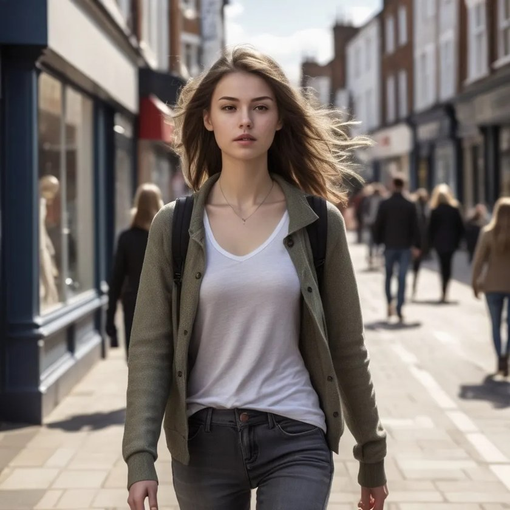

来源：[OpenArt · Photorealistic portrait](https://openart.ai/style-palettes)；平台 AI 风格样张。

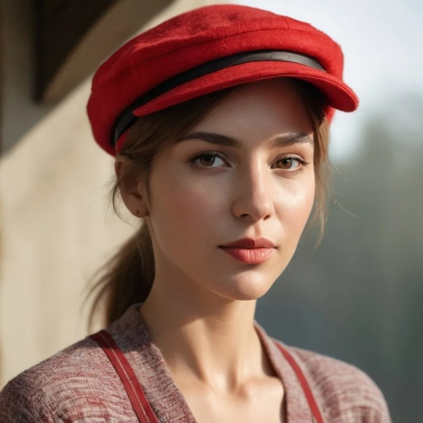

来源：[OpenArt · Photorealistic portrait](https://openart.ai/style-palettes)；平台 AI 风格样张。

定义参考：[来源页面](https://openart.ai/style-palettes)

### 胶片质感 · Analog film look

柔和高光、适量颗粒、轻微色偏和年代感，仍以真实摄影为底。

适合：记忆、旅行、青春、复古品牌叙事。

动态考虑：保持镜头节奏一致；颗粒与闪烁不要逐镜改变。

辨别与边界：颗粒不是越重越好；胶片质感可以温暖，也可以冷峻。

可选调性：怀旧温柔、自然亲近。

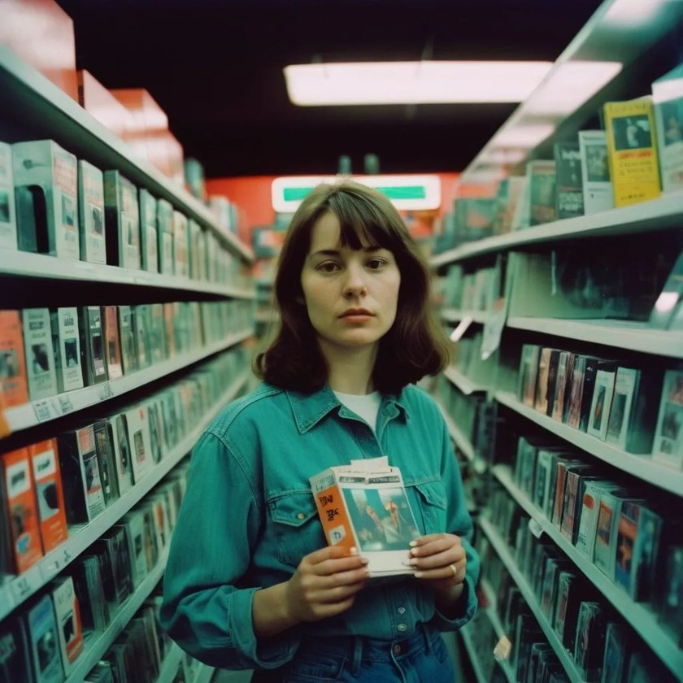

来源：[OpenArt · Analog Photography](https://openart.ai/style-palettes)；平台 AI 风格样张。

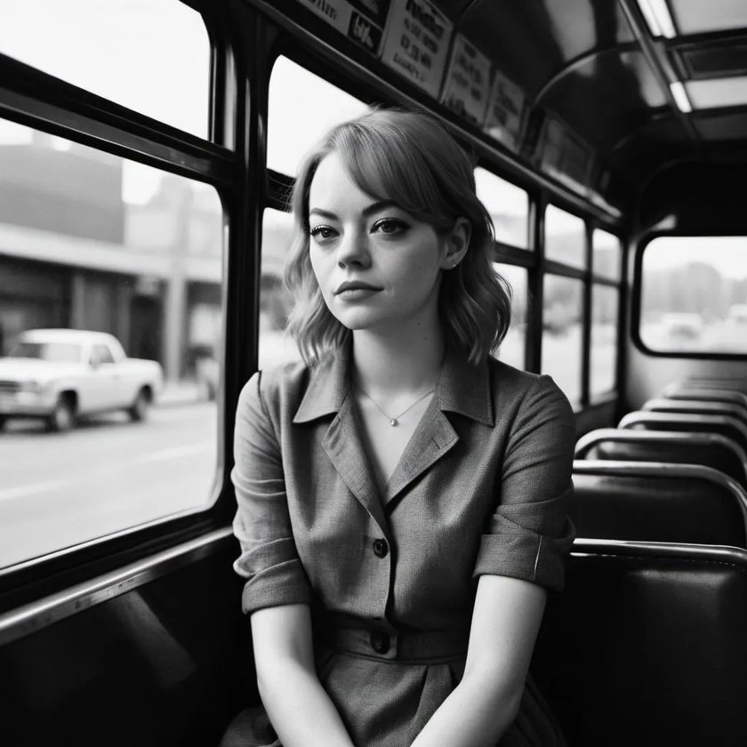

来源：[OpenArt · Dramatic black and white](https://openart.ai/style-palettes)；平台 AI 风格样张。

定义参考：[来源页面](https://openart.ai/style-palettes)

### 黑色电影 · Film noir

低调布光、强明暗反差、轮廓与阴影构图；常见黑白，也可使用受控色彩。

适合：悬疑、都市、神秘人物与戏剧性品牌故事。

动态考虑：用遮挡、视线和光影揭示信息，避免仅靠慢动作制造紧张。

辨别与边界：普通黑白画面不一定是黑色电影；关键在布光和叙事气氛。

可选调性：冷峻紧张、神秘暗黑。

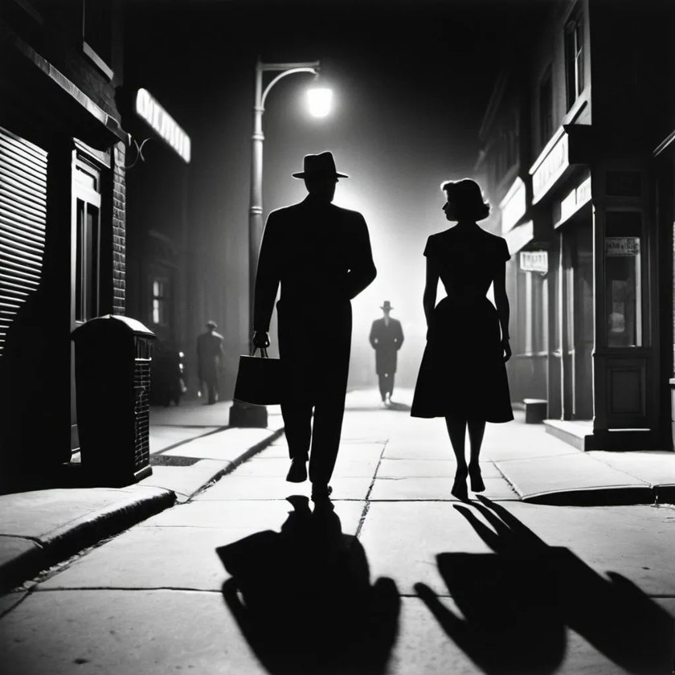

来源：[OpenArt · Film Noir](https://openart.ai/style-palettes)；平台 AI 风格样张。

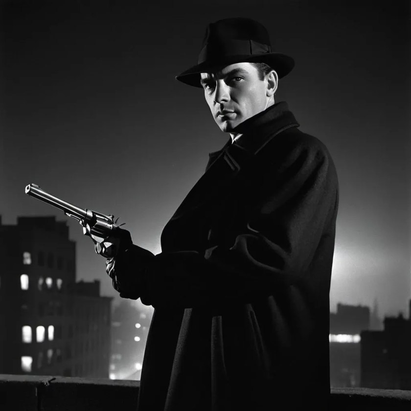

来源：[OpenArt · Film Noir](https://openart.ai/style-palettes)；平台 AI 风格样张。

定义参考：[来源页面](https://openart.ai/style-palettes)

## 2D／绘画

### 日漫／赛璐璐 · Anime / cel shading

清晰轮廓、概括的明暗色块、风格化人物与绘制背景。

适合：角色叙事、青春、冒险、轻幻想。

动态考虑：明确关键姿势与节奏；保留造型，不逐帧变成写实脸。

辨别与边界：日漫内部跨度很大；本卡先定基本渲染方式，再选年代和调性。

可选调性：明快活泼、自然亲近。

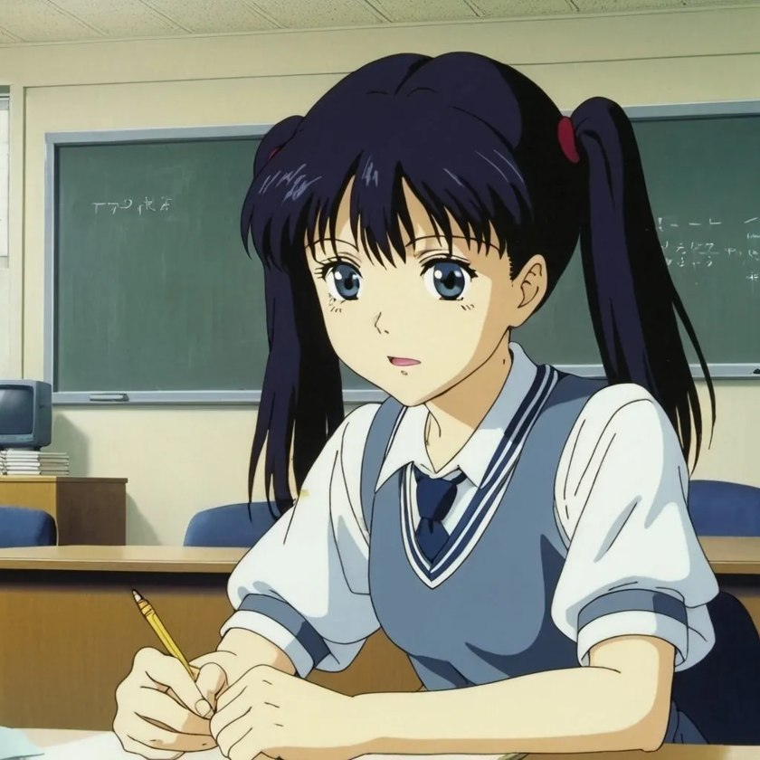

来源：[OpenArt · 1990s anime](https://openart.ai/style-palettes)；平台 AI 风格样张。

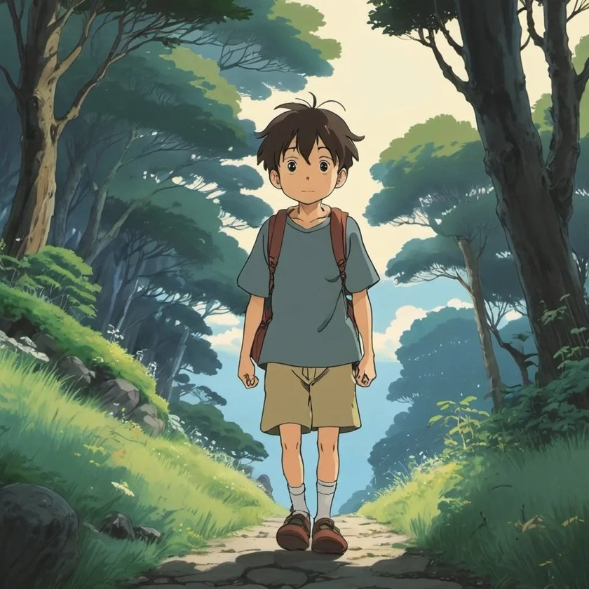

来源：[OpenArt · Studio Ghibli](https://openart.ai/style-palettes)；平台 AI 风格样张。

定义参考：[来源页面](https://midlibrary.io/styles/anime-style)

### 美式漫画／图像小说 · Comic / graphic novel

有力度的墨线、明暗块面、戏剧构图；可配网点或印刷纹理。

适合：动作、英雄、冲突强烈的品牌短片。

动态考虑：将分格感转化为清楚的镜头切换；不要把分镜格误生成整屏拼贴。

辨别与边界：美漫不只有超级英雄；本卡强调墨线与图像叙事。

可选调性：明快活泼、冷峻紧张。

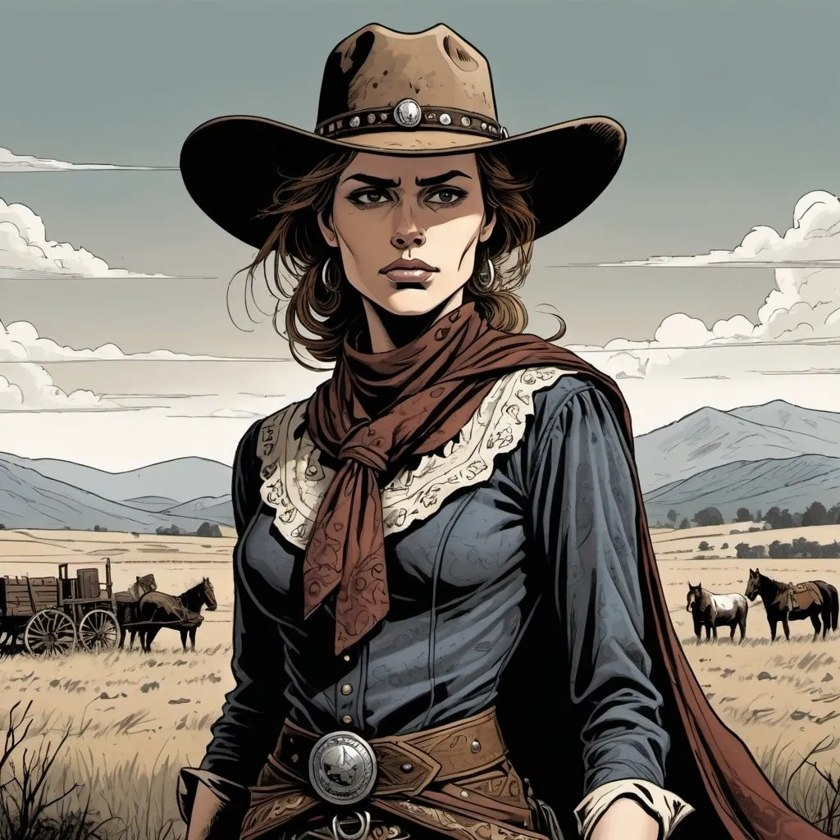

来源：[OpenArt · Retro comic](https://openart.ai/style-palettes)；平台 AI 风格样张。

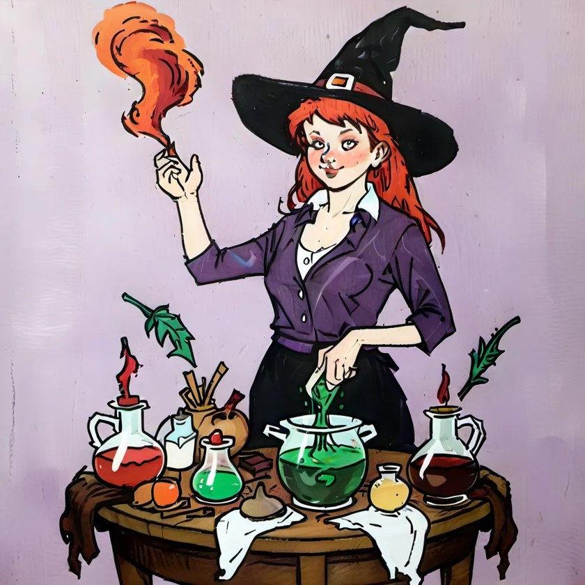

来源：[OpenArt · American comic sketch #1](https://openart.ai/style-palettes)；平台 AI 风格样张。

定义参考：[来源页面](https://openart.ai/style-palettes)

### 欧式清线漫画 · Ligne claire

均匀清楚的线条、整洁平涂、可读的场景细节和较少的排线阴影。

适合：旅行、冒险、城市与知识叙事。

动态考虑：动作和机位保持清晰，背景可读性优先。

辨别与边界：与美式重墨漫画的主要差异是线重、阴影和画面清洁度。

可选调性：明快活泼、自然亲近。

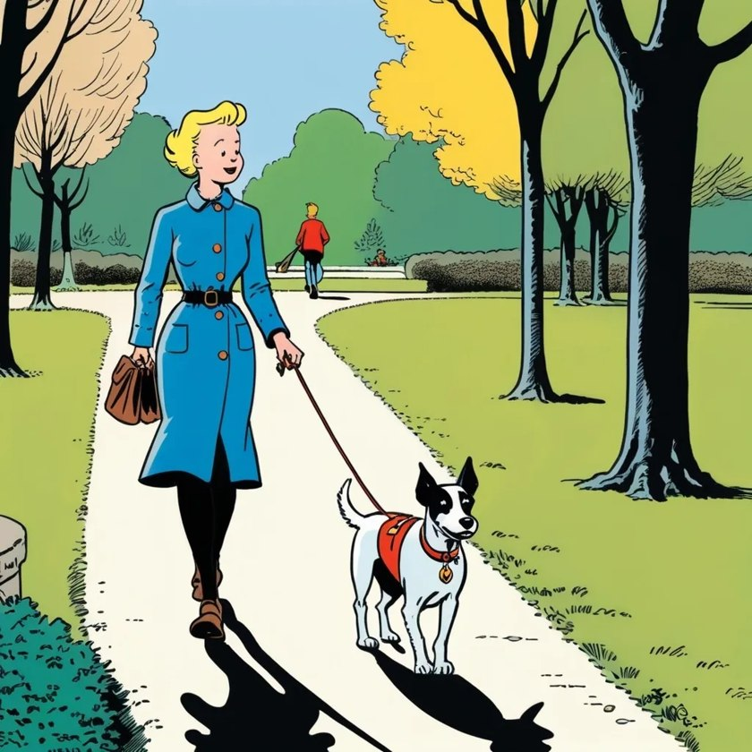

来源：[OpenArt · World of tintin](https://openart.ai/style-palettes)；平台 AI 风格样张。

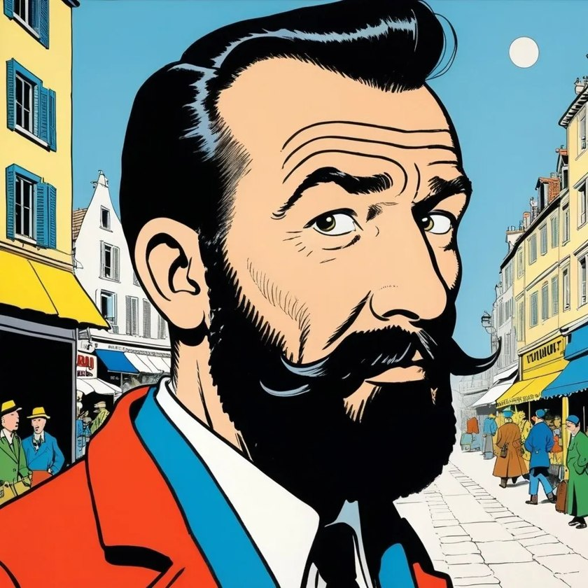

来源：[OpenArt · World of tintin](https://openart.ai/style-palettes)；平台 AI 风格样张。

定义参考：[来源页面](https://openart.ai/style-palettes)

### 复古橡皮管卡通 · Rubber-hose cartoon

弧线肢体、夸张表情、简化造型与早期卡通的印刷气息。

适合：喜剧、音乐感动作、趣味品牌角色。

动态考虑：伸缩、预备动作与回弹构成节奏；保持角色识别点。

辨别与边界：静帧只能展示造型；橡皮管运动需要在动画描述中另写。

可选调性：明快活泼、怀旧温柔。

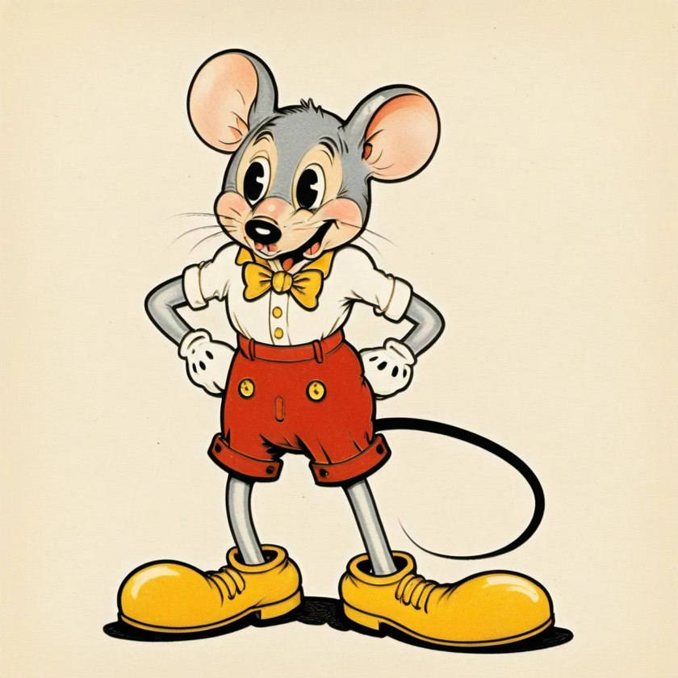

来源：[OpenArt · Early 30s](https://openart.ai/style-palettes)；平台 AI 风格样张。

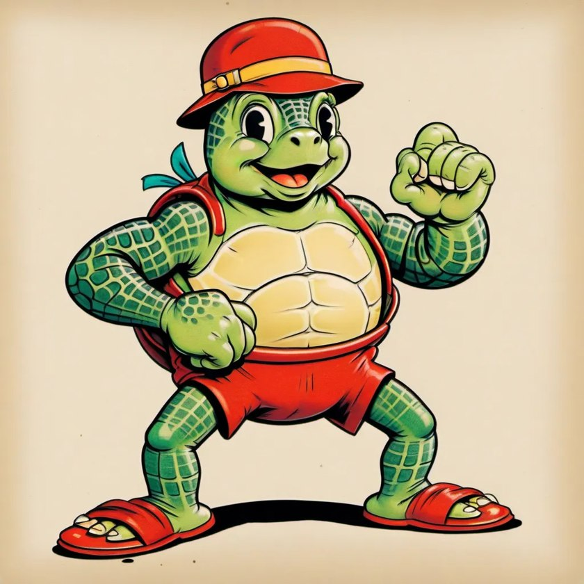

来源：[OpenArt · Early 30s](https://openart.ai/style-palettes)；平台 AI 风格样张。

定义参考：[来源页面](https://openart.ai/style-palettes)

### 绘本插画 · Storybook illustration

柔和形体、可见绘画笔触、亲切人物与叙事性环境。

适合：儿童、亲子、教育、温柔的品牌故事。

动态考虑：动作简洁、情绪可读，避免画面信息压过故事。

辨别与边界：绘本是较宽的视觉家族；选定后仍需固定笔触和人物比例。

可选调性：温暖治愈、梦幻诗意。

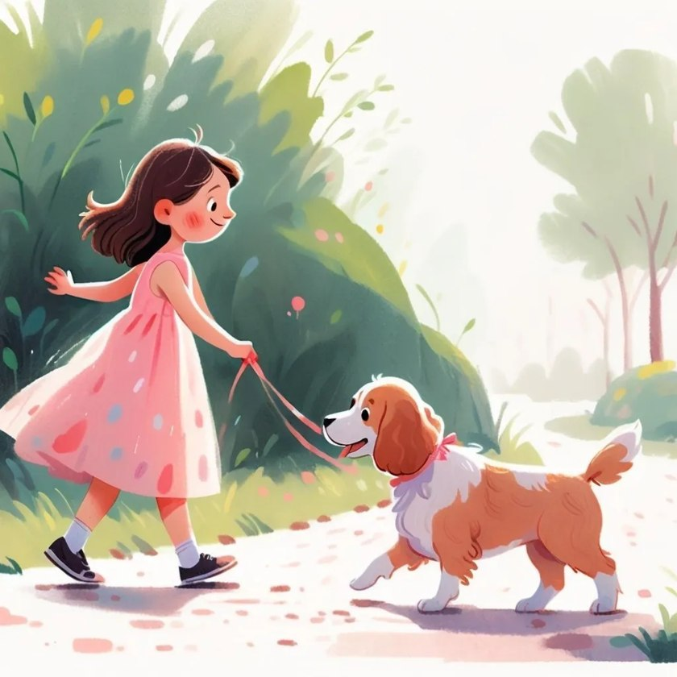

来源：[OpenArt · Children book #1](https://openart.ai/style-palettes)；平台 AI 风格样张。

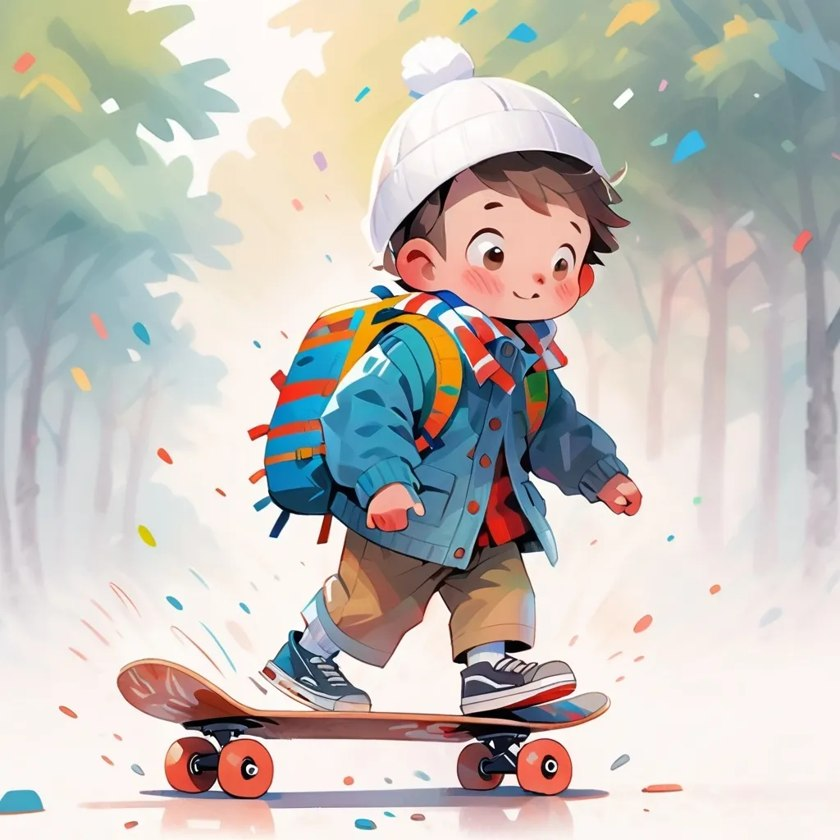

来源：[OpenArt · Children book #1](https://openart.ai/style-palettes)；平台 AI 风格样张。

定义参考：[来源页面](https://openart.ai/style-palettes)

### 水彩 · Watercolor

透明叠色、晕染边缘、留白与纸张肌理，轮廓可软可硬。

适合：自然、生活、抒情与轻盈的品牌内容。

动态考虑：色块变化保持连贯，避免每帧笔触随机重画造成闪烁。

辨别与边界：不把水彩限定为粉彩或女性肖像；主体与颜色可自由变化。

可选调性：梦幻诗意、温暖治愈。

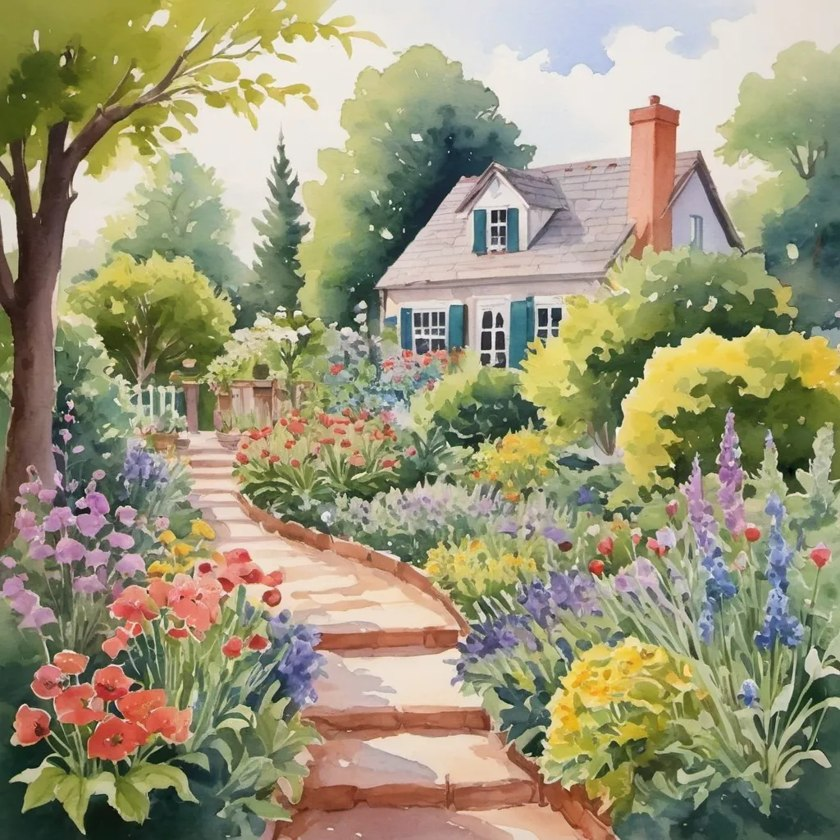

来源：[OpenArt · Gouache watercolor](https://openart.ai/style-palettes)；平台 AI 风格样张。

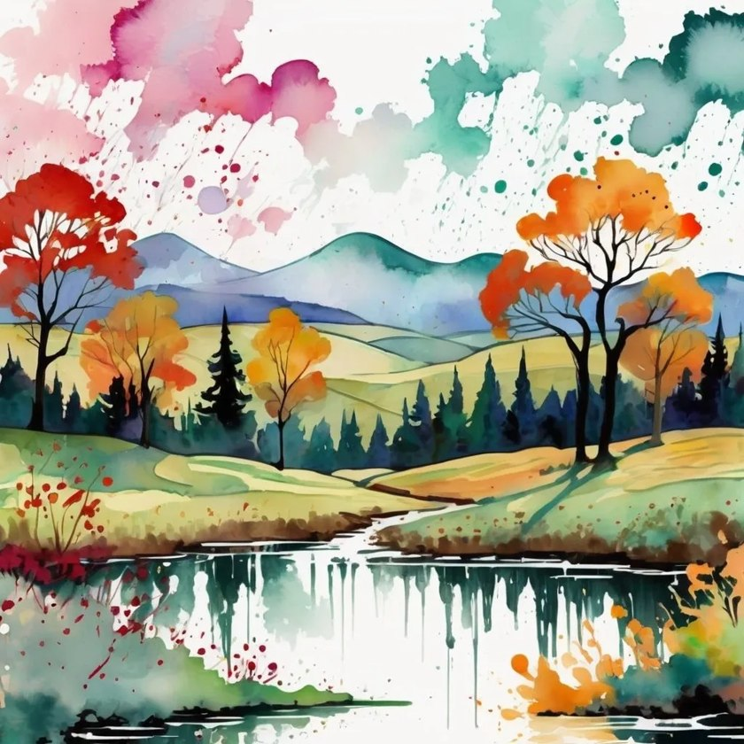

来源：[OpenArt · Digital watercolor](https://openart.ai/style-palettes)；平台 AI 风格样张。

定义参考：[来源页面](https://midlibrary.io/styles/watercolor-paint)

### 东方水墨 · Ink wash

墨色浓淡、干湿笔触、虚实与留白；可配少量设色。

适合：文化、山水、茶饮、诗意与东方叙事。

动态考虑：安排墨迹出现、扩散和收束的节奏，主体动作仍要可读。

辨别与边界：水墨不是泛指所有国风；青绿重彩与工笔应另作具体美术选择。

可选调性：梦幻诗意、克制高级。

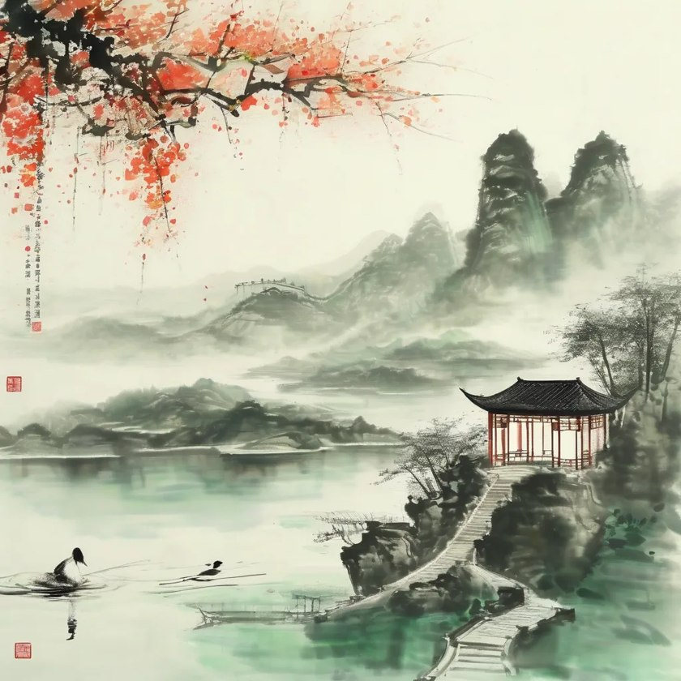

来源：[OpenArt · Chinese ink](https://openart.ai/style-palettes)；平台 AI 风格样张。

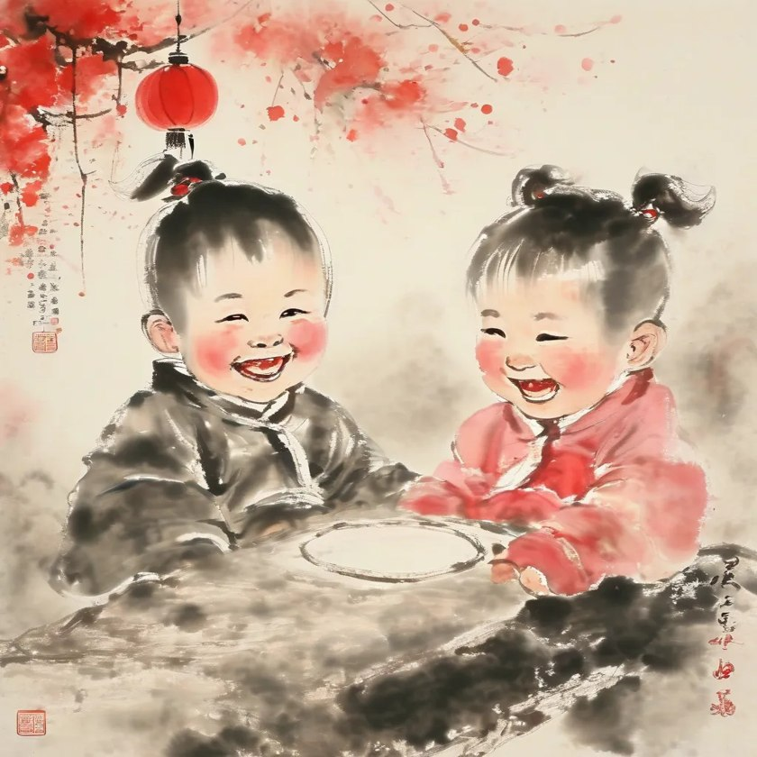

来源：[OpenArt · Chinese ink](https://openart.ai/style-palettes)；平台 AI 风格样张。

定义参考：[来源页面](https://openart.ai/style-palettes)

### 油画笔触 · Painterly oil

厚薄不一的笔触、混色层次和块面塑造，保留手绘触感。

适合：艺术、人物、历史与情绪性短片。

动态考虑：固定笔触尺度，避免纹理无目的沸腾；动作轮廓保持稳定。

辨别与边界：油画可写实也可抽象；本卡主要定义笔触与色层。

可选调性：克制高级、梦幻诗意。

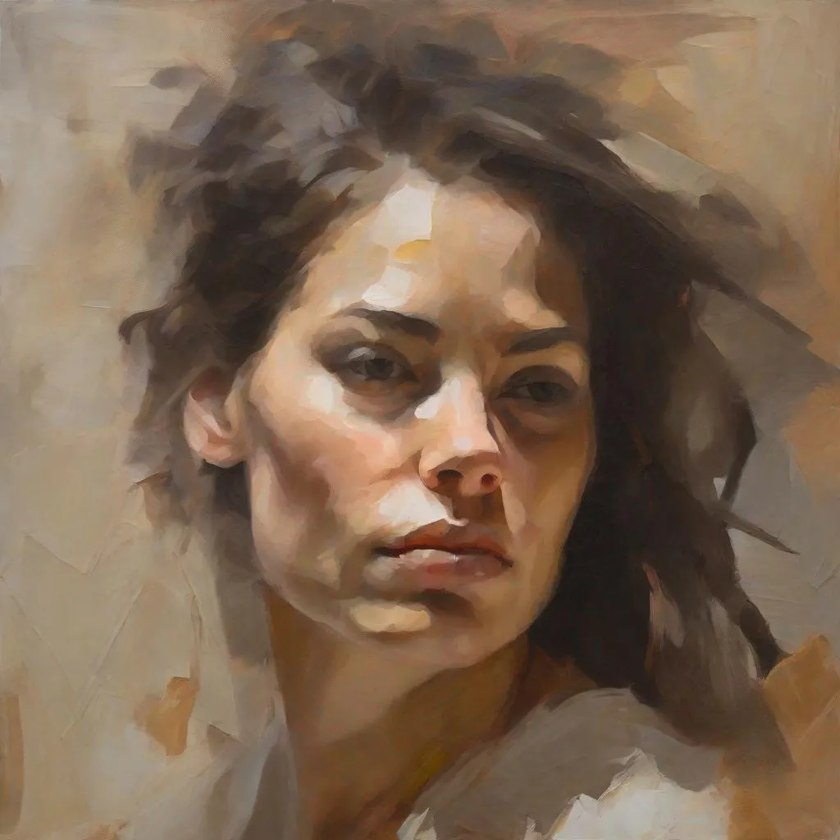

来源：[OpenArt · Oilpaint](https://openart.ai/style-palettes)；平台 AI 风格样张。

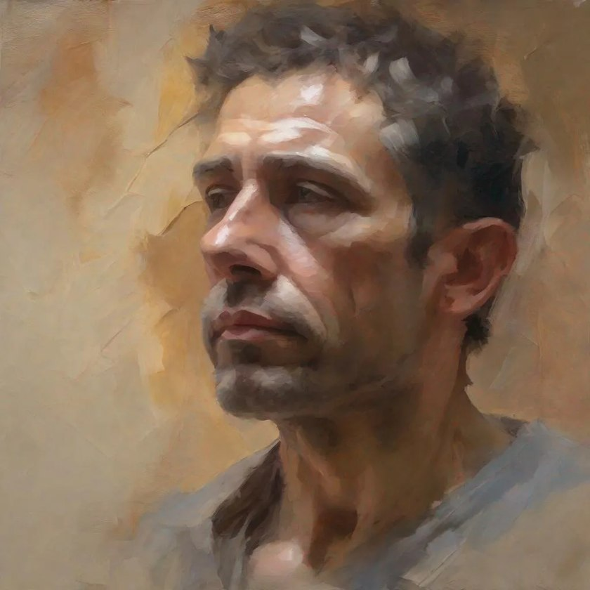

来源：[OpenArt · Oilpaint](https://openart.ai/style-palettes)；平台 AI 风格样张。

定义参考：[来源页面](https://openart.ai/style-palettes)

### 扁平图形 · Flat graphic illustration

简洁几何轮廓、大色块、有限层次，图形关系清楚。

适合：演示动画、解释型内容、服务与品牌传播。

动态考虑：以位移、缩放、形变和转场建立节奏，信息逐步出现。

辨别与边界：演示动画属于用途；这里选的是它可以采用的图形画风。

可选调性：明快活泼、克制高级。

来源：[OpenArt · Flat vector illustration](https://openart.ai/style-palettes)；平台 AI 风格样张。

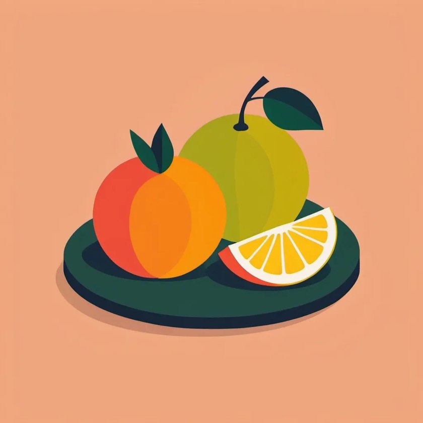

来源：[OpenArt · Flat vector illustration](https://openart.ai/style-palettes)；平台 AI 风格样张。

定义参考：[来源页面](https://openart.ai/style-palettes)

### 极简线描 · Minimal line illustration

少量线条勾勒人物或事物，以轮廓、留白与少量强调色建立识别。

适合：概念解释、流程、轻量品牌故事。

动态考虑：描线、路径与形变可参与叙事，线宽和端点保持统一。

辨别与边界：与扁平插画的区别是以线为主；不默认需要手写板或白板演示。

可选调性：克制高级、温暖治愈。

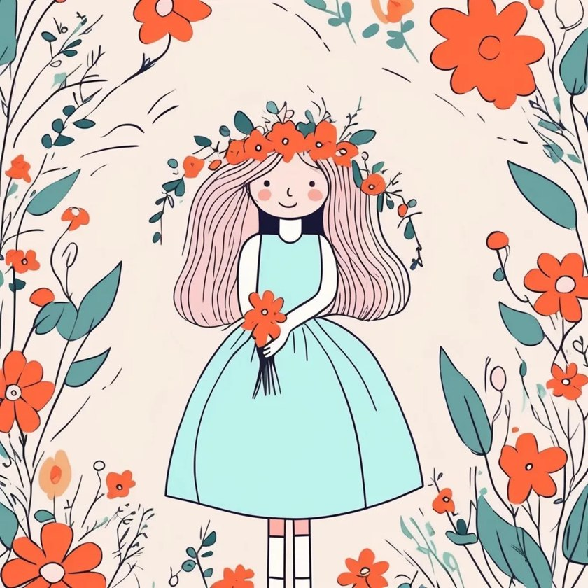

来源：[OpenArt · Simple line art](https://openart.ai/style-palettes)；平台 AI 风格样张。

来源：[OpenArt · Simple line art](https://openart.ai/style-palettes)；平台 AI 风格样张。

定义参考：[来源页面](https://openart.ai/style-palettes)

### 像素艺术 · Pixel art

可辨像素网格、有限色板和有设计的阶梯轮廓，场景也遵循同一尺度。

适合：游戏、复古、轻喜剧与数字品牌。

动态考虑：动作可分档但节奏明确，镜头缩放保持像素尺度。

辨别与边界：不是把普通图简单打马赛克；像素构形需要主动设计。

可选调性：怀旧温柔、明快活泼。

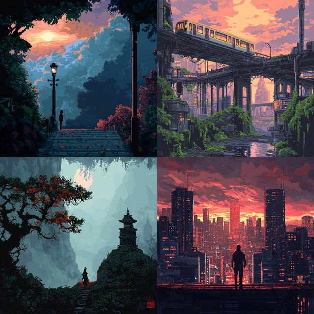

来源：[Midlibrary · Pixel Art](https://midlibrary.io/styles/pixel-art)；Midjourney AI 风格样张（原页面四宫格）。

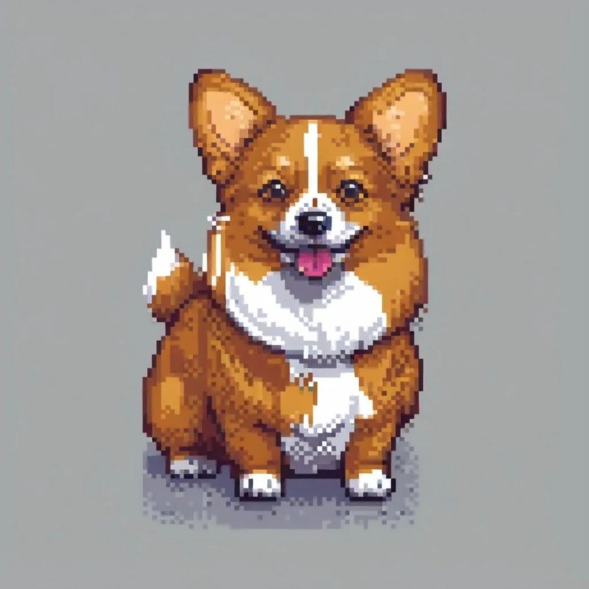

来源：[OpenArt · Pixel art](https://openart.ai/style-palettes)；平台 AI 风格样张。

定义参考：[来源页面](https://midlibrary.io/styles/pixel-art)

## 3D／CG

### 风格化 3D 卡通 · Stylized 3D animation

概括且富有表现力的形体、立体光照和统一材质；可从可爱到成熟。

适合：角色故事、家庭向内容、产品角色化。

动态考虑：保持体积、关节和表情的连贯；动作要有重量与预备。

辨别与边界：3D 卡通不等于所有人物都要大头大眼；比例需由影片决定。

可选调性：温暖治愈、明快活泼。

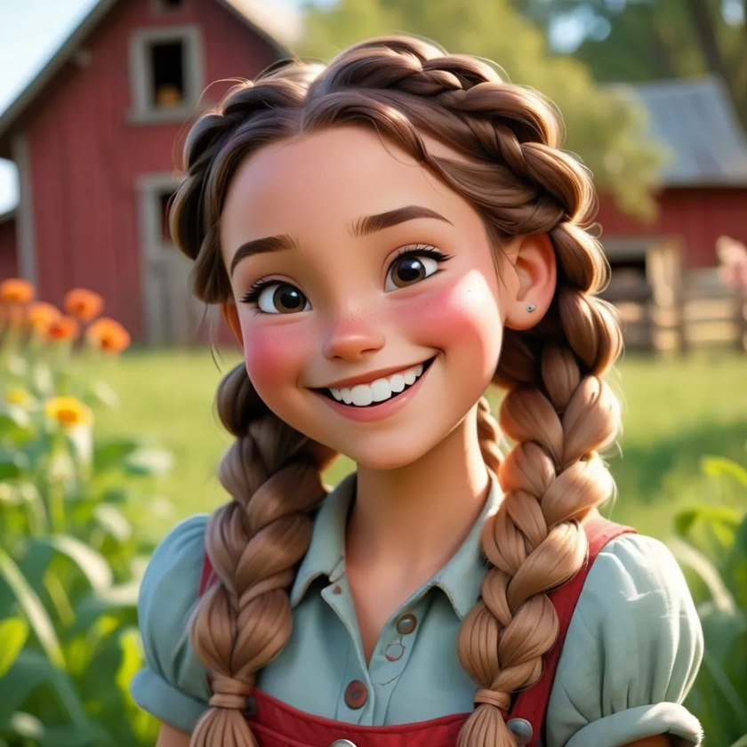

来源：[OpenArt · Pixar #1](https://openart.ai/style-palettes)；平台 AI 风格样张。

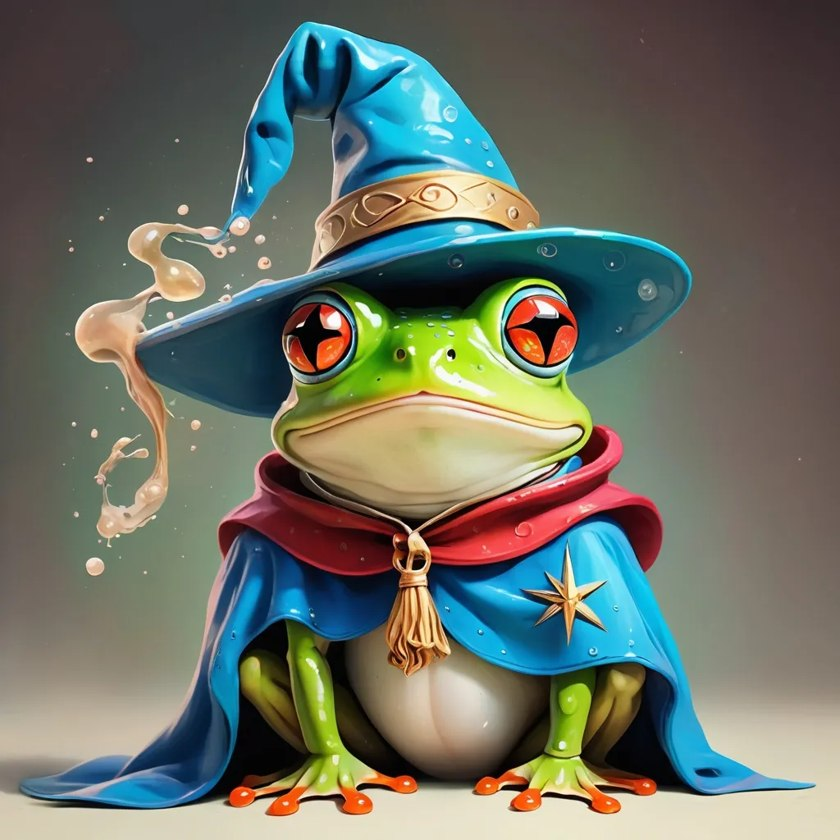

来源：[OpenArt · 3D characters](https://openart.ai/style-palettes)；平台 AI 风格样张。

定义参考：[来源页面](https://openart.ai/style-palettes)

### 写实比例的幻想 3D · Stylized realistic 3D

接近成人或真实生物的比例，结合精细服饰、发丝与风格化光照。

适合：东方幻想、国漫常见的古风冒险、史诗与角色短片。

动态考虑：衣物、头发与身体动作互相影响，细节不应逐镜漂移。

辨别与边界：国漫不是单一画风；这里收录其中常见的一类 3D 方向。

可选调性：宏大壮阔、梦幻诗意。

来源：[GKIDS · White Snake](https://gkids.com/films/white-snake/)；作品官方参考。

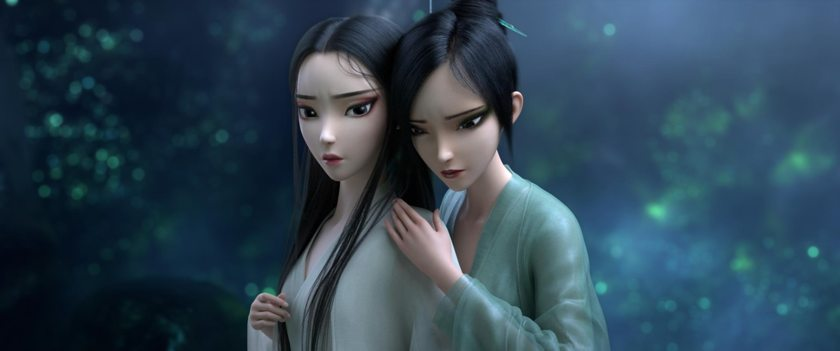

来源：[GKIDS · White Snake](https://gkids.com/films/white-snake/)；作品官方参考。

定义参考：[来源页面](https://gkids.com/films/white-snake/)

### 低多边形 · Low-poly

有意保留几何面、简化体积与分面明暗，轮廓清楚。

适合：科技解释、空间展示、游戏化品牌内容。

动态考虑：运动时保持几何面的拓扑稳定，不随机增减细节。

辨别与边界：低多边形强调面；体素强调方块单元，两者不合并。

可选调性：克制高级、明快活泼。

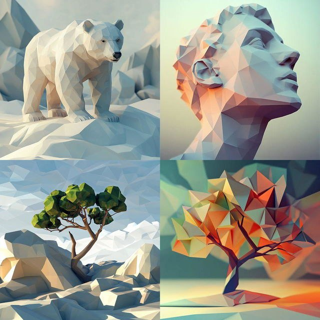

来源：[Midlibrary · Low Poly](https://midlibrary.io/styles/low-poly)；Midjourney AI 风格样张（原页面四宫格）。

来源：[OpenArt · Low poly](https://openart.ai/style-palettes)；平台 AI 风格样张。

定义参考：[来源页面](https://midlibrary.io/styles/low-poly)

### 体素方块 · Voxel

用规则体素块搭建角色与世界，体积和像素式节奏同时可见。

适合：游戏化故事、空间搭建、数字世界与解释内容。

动态考虑：方块拼装和拆解可作为动作，尺度要统一。

辨别与边界：不是所有低模都是体素；本方向保留清楚的方块单元。

可选调性：明快活泼、怀旧温柔。

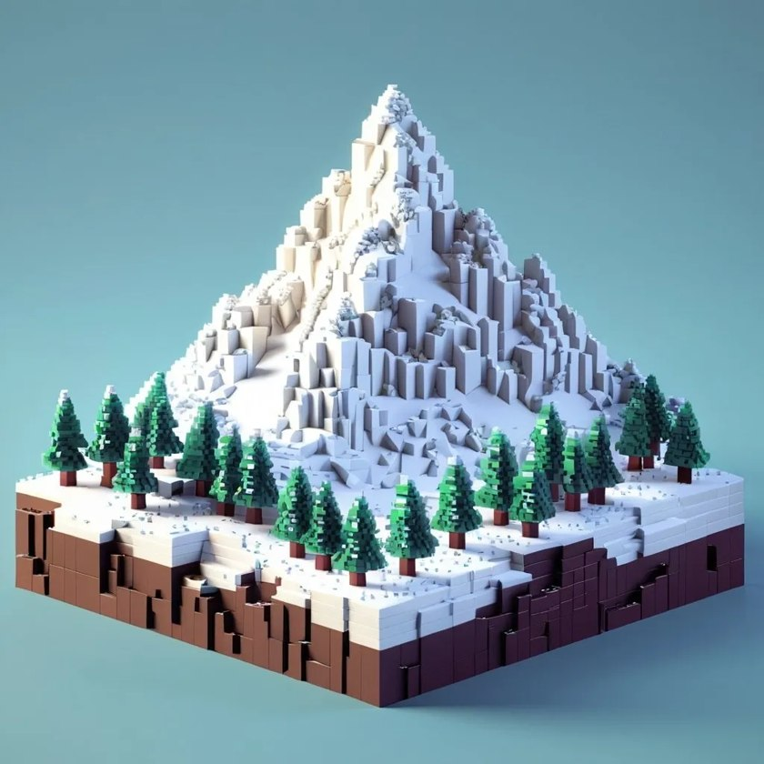

来源：[OpenArt · Voxel](https://openart.ai/style-palettes)；平台 AI 风格样张。

定义参考：[来源页面](https://openart.ai/style-palettes)

## 定格／手作感

### 黏土定格感 · Claymation look

可塑黏土的厚度、手工表面与有形体的角色；场景带微缩制作感。

适合：亲切幽默、食物、手作、角色品牌故事。

动态考虑：用明确姿势与适度停顿表现手作节奏，同时避免不受控抖动。

辨别与边界：选此卡是在选择视觉与运动方向，不承诺一定使用实物逐格拍摄。

可选调性：温暖治愈、明快活泼。

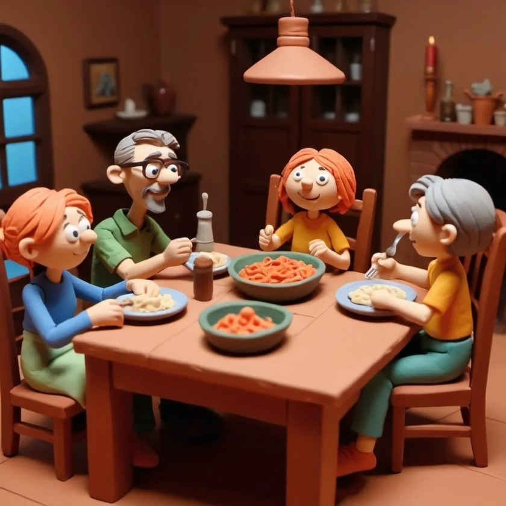

来源：[OpenArt · Claymation](https://openart.ai/style-palettes)；平台 AI 风格样张。

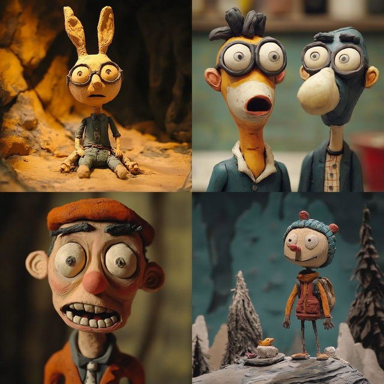

来源：[Midlibrary · Claymation](https://midlibrary.io/styles/claymation)；Midjourney AI 风格样张（原页面四宫格）。

定义参考：[来源页面](https://midlibrary.io/styles/claymation)

### 木偶／人偶定格感 · Puppet stop-motion look

有布料、硬质面部或可见手工结构的人偶，在微缩灯光环境中表演。

适合：寓言、童话、工艺、奇趣或暗黑故事。

动态考虑：身体关节与服装有约束，姿势转换有逐格表演的节奏。

辨别与边界：木偶不等于恐怖；本库样张包含温暖与暗调，调性另选。

可选调性：温暖治愈、神秘暗黑。

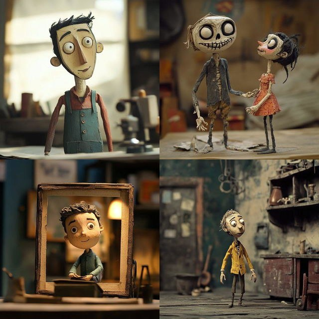

来源：[Midlibrary · Stop Motion Animation](https://midlibrary.io/styles/stop-motion-animation)；Midjourney AI 风格样张（原页面四宫格）。

定义参考：[来源页面](https://midlibrary.io/styles/stop-motion-animation)

### 羊毛毡／织物手作 · Felt / textile miniature

可见纤维、柔软边缘、缝线或绒毛，以材质触感形成识别。

适合：亲子、手工、温暖生活和可爱角色。

动态考虑：柔软材质响应挤压，绒毛变化稳定；可选择定格式动作节奏。

辨别与边界：羊毛毡是材质方向；单张图不能证明它是实拍定格。

可选调性：温暖治愈、明快活泼。

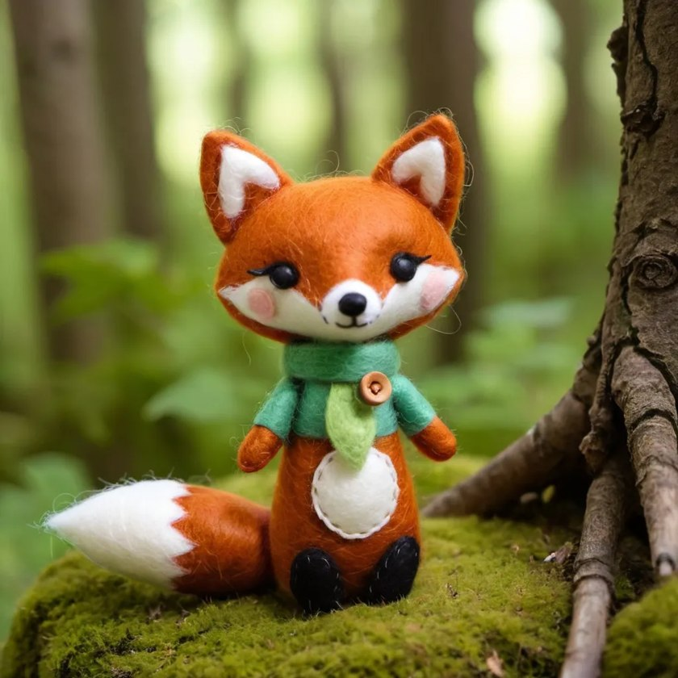

来源：[OpenArt · Wool felt](https://openart.ai/style-palettes)；平台 AI 风格样张。

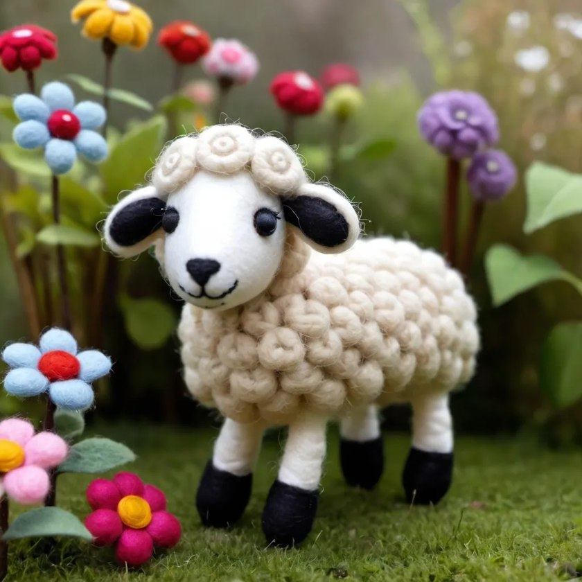

来源：[OpenArt · Wool felt](https://openart.ai/style-palettes)；平台 AI 风格样张。

定义参考：[来源页面](https://openart.ai/style-palettes)

### 纸艺／剪纸 · Paper craft / cutout

可辨纸张厚度、切边、折痕和叠层投影，空间由纸层构成。

适合：文化、节庆、故事书、空间展开与品牌展示。

动态考虑：展开、折叠、平移或分层视差应符合纸层关系。

辨别与边界：纸雕立体空间与平面剪纸可以分支选择；不默认所有纸艺都用定格。

可选调性：梦幻诗意、温暖治愈。

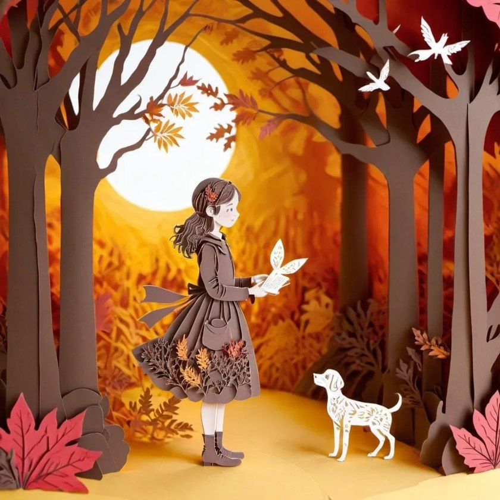

来源：[OpenArt · Papercut](https://openart.ai/style-palettes)；平台 AI 风格样张。

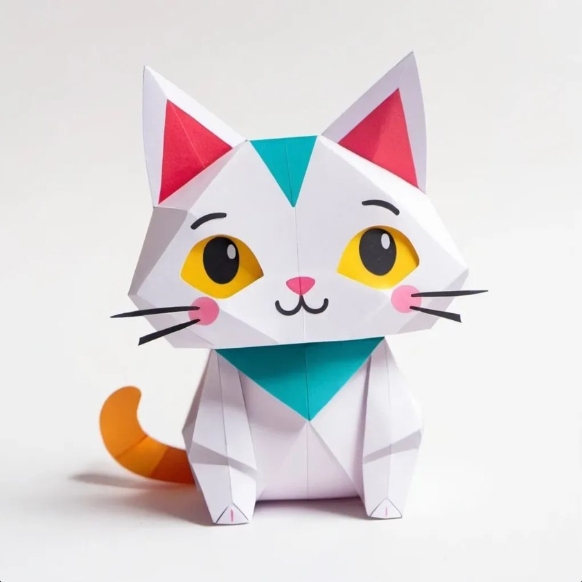

来源：[OpenArt · Paper toy](https://openart.ai/style-palettes)；平台 AI 风格样张。

定义参考：[来源页面](https://midlibrary.io/styles/paper-cutout)

### 剪影／影戏 · Silhouette / shadow animation

以轮廓、负空间和明暗层次表达人物与动作，弱化内部细节。

适合：寓言、神话、文化叙事、简洁而有象征性的故事。

动态考虑：侧面姿势和肢体分离度优先，防止动作重叠成难读的黑块。

辨别与边界：剪影也能用 2D 制作；它是视觉方向，不专属于实物定格。

可选调性：梦幻诗意、神秘暗黑。

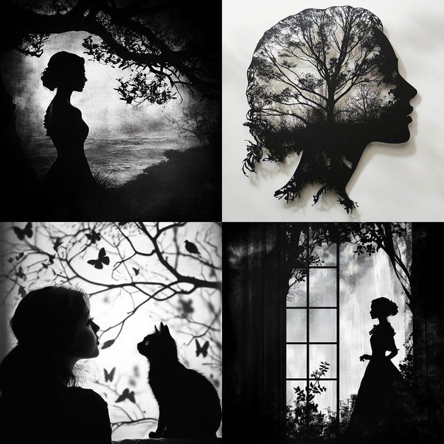

来源：[Midlibrary · Silhouette](https://midlibrary.io/styles/silhouette)；Midjourney AI 风格样张（原页面四宫格）。

定义参考：[来源页面](https://midlibrary.io/styles/silhouette)

## 混合媒介

### 拼贴混合媒介 · Mixed-media collage

把摄影、纸张、印刷纹理与图形组合成一个有意设计的画面。

适合：潮流、文化、编辑型叙事、表达态度的品牌片。

动态考虑：元素分层与遮挡关系明确，拼贴切换要承担叙事作用。

辨别与边界：不是随意混入不相容的风格；需要共同的色彩与构图逻辑。

可选调性：明快活泼、怀旧温柔。

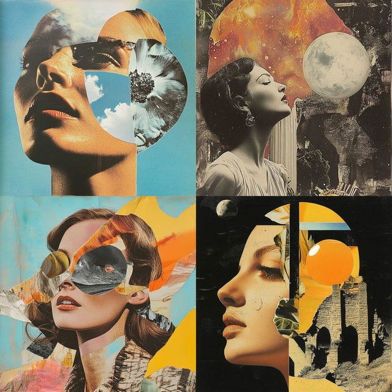

来源：[Midlibrary · Collage](https://midlibrary.io/styles/collage)；Midjourney AI 风格样张（原页面四宫格）。

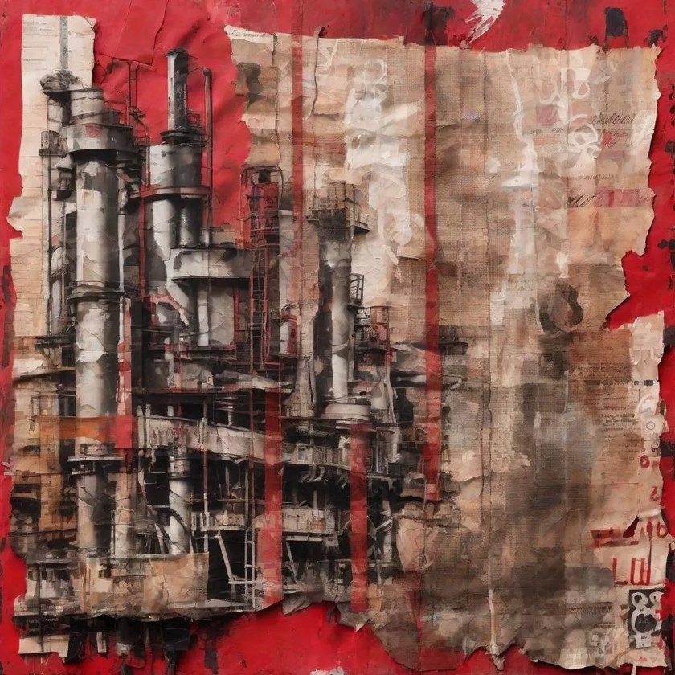

来源：[OpenArt · Collage](https://openart.ai/style-palettes)；平台 AI 风格样张。

定义参考：[来源页面](https://midlibrary.io/styles/collage)

### 实拍与图形叠加 · Live action + graphic overlays

真实摄影与插画、形状或界面图形同屏，主体和信息各有明确位置。

适合：产品解释、品牌服务、知识与生活方式短片。

动态考虑：图形跟随动作或信息节奏出现，空间跟踪与遮挡保持合理。

辨别与边界：屏幕文字与精确 UI 建议独立制作；样图只作视觉关系参考。

可选调性：明快活泼、自然亲近。

来源：[BUCK · Headspace Members](https://buck.co/work/headspace-members)；作品官方参考。

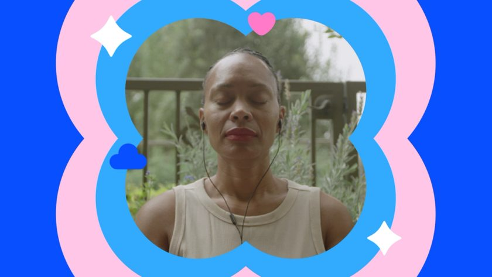

来源：[BUCK · Headspace Members](https://buck.co/work/headspace-members)；作品官方参考。

定义参考：[来源页面](https://buck.co/work/headspace-members)

## 可跨形式组合的美术方向

### 赛博朋克 · Cyberpunk

高科技与破败都市并置，电子界面、义体、拥挤城市和人工光共同构建世界。

适合：科技寓言、未来都市、动作与反乌托邦故事。

动态考虑：环境与角色动作遵循同一空间，光源与反射方向连续。

辨别与边界：霓虹配色本身不等于赛博朋克；它可叠加在写实、动漫或 3D 上。

可选调性：冷峻紧张、神秘暗黑。

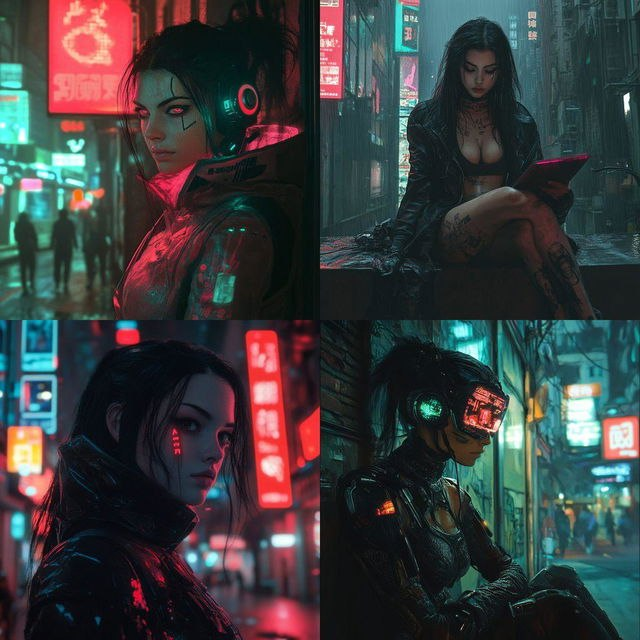

来源：[Midlibrary · Cyberpunk](https://midlibrary.io/styles/cyberpunk)；Midjourney AI 风格样张（原页面四宫格）。

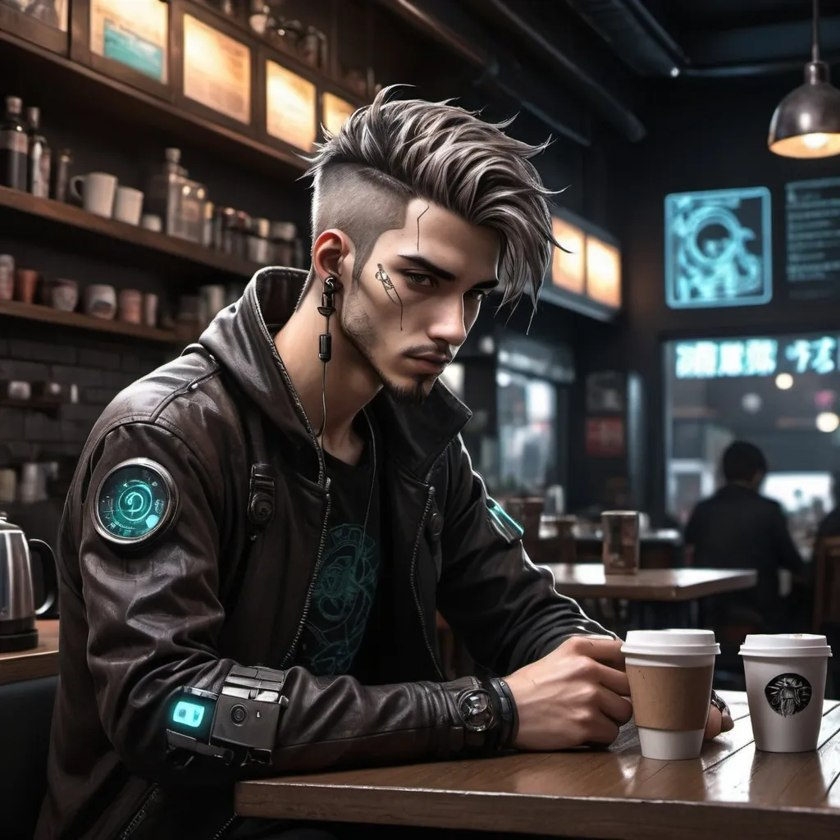

来源：[OpenArt · Cyberpunk anime](https://openart.ai/style-palettes)；平台 AI 风格样张。

定义参考：[来源页面](https://midlibrary.io/styles/cyberpunk)

### 奇幻世界 · Fantasy

通过超现实生物、魔法、建筑或自然景观，构建内部规则一致的世界。

适合：冒险、童话、文化想象与史诗叙事。

动态考虑：先确定世界中的物理或魔法规则，再安排动作与转场。

辨别与边界：奇幻是世界方向；先选绘制或渲染方式，再决定可爱、暗黑或史诗。

可选调性：梦幻诗意、宏大壮阔。

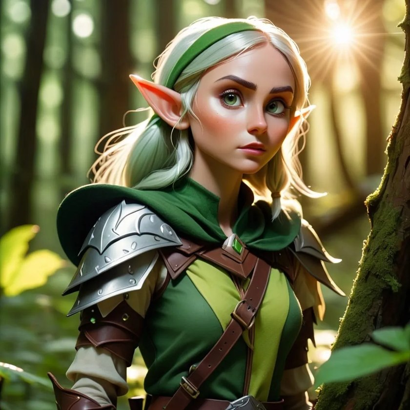

来源：[OpenArt · Vibrant fantasy](https://openart.ai/style-palettes)；平台 AI 风格样张。

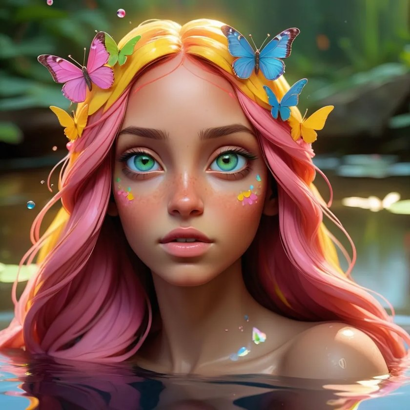

来源：[OpenArt · Vibrant fantasy](https://openart.ai/style-palettes)；平台 AI 风格样张。

定义参考：[来源页面](https://openart.ai/style-palettes)

### 超现实 · Surrealism

通过不可能的比例、空间或物体组合建立梦境逻辑，形式可以精确而可信。

适合：概念广告、梦境、情绪与艺术短片。

动态考虑：不可能的变形也要有清楚的起因和视觉连接，避免随机幻化。

辨别与边界：超现实不是所有奇怪画面的总称；一个场景最好围绕一个核心视觉关系。

可选调性：梦幻诗意、神秘暗黑。

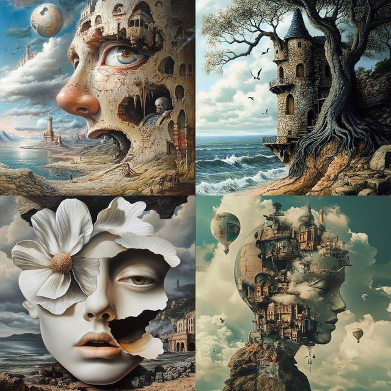

来源：[Midlibrary · Surrealism](https://midlibrary.io/styles/surrealism)；Midjourney AI 风格样张（原页面四宫格）。

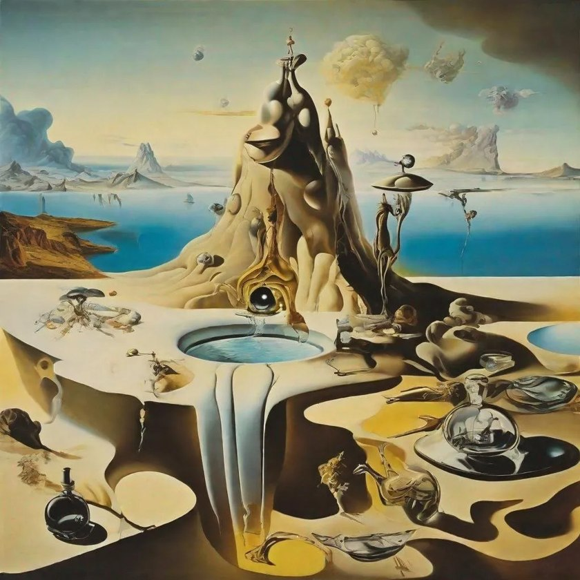

来源：[OpenArt · Dali surrealism](https://openart.ai/style-palettes)；平台 AI 风格样张。

定义参考：[来源页面](https://midlibrary.io/styles/surrealism)

## 调性选择

- **自然亲近**：可信细节、舒适距离、自然表演与从容节奏。
- **温暖治愈**：柔和关系、照顾细节、温柔节奏；不强制一律暖黄色。
- **明快活泼**：清楚的视觉重点、鲜明节奏和富有弹性的动作。
- **克制高级**：节制的色彩与装饰、精确构图、留白及有目的的运动。
- **怀旧温柔**：选择一致的年代线索，结合材质、声音与生活细节。
- **冷峻紧张**：明确光比、距离感、压迫或悬念，控制信息揭示。
- **宏大壮阔**：建立空间尺度、远近层次和有分量的动作与节奏。
- **梦幻诗意**：让意象、色彩和转场有内在联系，保留理解空间。
- **神秘暗黑**：控制可见信息和未知感，不默认暴力或恐怖造型。

## 来源与维护

主要样图来自 Midlibrary 和 OpenArt；具体缺口补充作品官方参考。模型版本、来源、文件校验值与检查状态见 atlas.json。缩略图用于个人离线定调，不是生产用高清参考或公开素材授权。

中文解释和应用建议为本库整理。条目真源为 atlas.json，运行 tools/rebuild_views.py 生成浏览器数据和本 Markdown；程序不联网。
