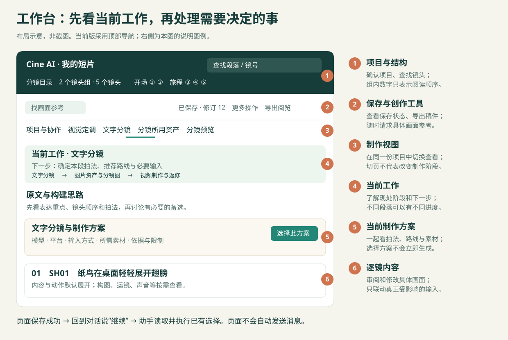

# 🎬 Cine AI Video Director 中文使用手册

这份手册按实际制作顺序说明：从哪里开始，每个阶段为什么要做，你需要决定什么，以及怎样继续。第一次使用可以从头阅读；已有项目时，直接找对应环节。

**最常见的用法是：在对话里提出需求，在工作台里看方案和素材，保存选择后回到对话说“继续”。** 助手读取当前状态，完成已经约定的下一步。你不用自己维护内部数据字段，也不用为了继续工作反复确认相同决定。

[安装与准备](#setup) · [制作流程](#process) · [只有想法的例子](#example) · [工作台布局与操作](#workbench) · [修改与返修](#revision) · [启动命令](#commands) · [常见问题](#faq)

<a id="setup"></a>
## 1. 安装与准备

### 运行需要什么

| 项目 | 什么时候需要 |
| --- | --- |
| 能加载本地 Skill 的 Codex 环境 | 使用这套助手制作流程 |
| Node.js 20+、能访问本私有仓库的 Git | 使用随包安装器安装或更新 |
| Python 3.10+、浏览器 | 启动和使用本地工作台 |
| 相应图片、视频平台的工具与账号 | 实际生成素材；讨论分镜时不必提前接通所有平台 |
| Pillow | 使用内置组图排版或画格提取工具时 |
| ffmpeg / ffprobe | 涉及相应音视频处理与技术检查时 |
| Blender、Topaz 或其他专项工具 | 方案确实需要且你选择使用时 |

基础工作台使用 Python 标准库，内置视觉图鉴随包提供。平台能力、登录状态、付费额度和专项工具不会随本 Skill 自动配齐。安装器不会替你安装上表全部软件。

目前有 macOS 的实际安装与工作台验证；Windows 安装路径有模拟测试，不能据此声称已经覆盖各系统的完整原生制作链路。更详细条件见[移植说明](../references/portability.md)。

### 安装或更新

先确保终端中的 Git 可以访问 `rickyk1z1/cine-ai-video-director`，再执行：

```sh
npm exec --yes --package=github:rickyk1z1/cine-ai-video-director#v3.2.0 -- cine-ai-video-director
```

命令固定到一个已发布版本，便于不同机器使用同一套规则。安装器会输出实际安装目录：如果检测到唯一的旧名 `cinematic-storyboard` 安装，会先核对安装记录与文件，再迁移到同一安装根的新名称目录；已有新名则直接更新。全新安装默认使用 `~/.agents/skills/cine-ai-video-director`。

若需要明确指定 Skill 的上一级目录，可以使用：

```sh
npm exec --yes --package=github:rickyk1z1/cine-ai-video-director#v3.2.0 -- cine-ai-video-director --skills-root "$HOME/.codex/skills"
```

不要同时维护新旧名称的两份现役 Skill。旧安装有本地改动或缺少可核对的安装记录时，安装器会保留它并停止，不会直接覆盖。安装器发现多个位置或无法确认的本地修改会停止，旧文件会保留。让助手核对差异后再更新，不要通过删除目录绕过保护。

分享给朋友的权限配置见[私有分享说明](SHARING.md)。

安装完成后新开一个 Codex 对话；未加载到 Skill 时重启 Codex。把视频项目放在你希望长期保存资料的位置，后续继续使用同一目录。工作台数据与生成素材属于项目，不放进 Skill 安装目录。

<a id="process"></a>
## 2. 先理解这条制作流程

工作台用“文字分镜 → 图片资产与分镜图 → 视频制作与返修”三个阶段帮助定位当前工作。它们不是只能单向通过的关卡：你可以在制作图片时改文字，也可以在看视频后调整拍法；已经明确的决定仍然有效。

一个新作品通常这样推进：

| 环节 | 本阶段解决什么 | 常见产出 | 怎样继续 |
| --- | --- | --- | --- |
| 明确意图 | 观众应该看到、理解和感受到什么 | 简报、范围、已有条件与缺口 | 表达方向足够清楚，就开始设计 |
| 视觉定调 | 画面整体看起来怎样 | 选定风格及本片补充要求 | 选定方向，或沿用已有风格 |
| 文字分镜与路线 | 怎么拍、怎么生成、缺哪些输入 | 镜头方案、推荐路线、必要素材清单 | 一起确认当前方案和实际开工范围 |
| 准备必要输入 | 让角色、场景和关键变化可被控制 | 母图、分镜图或其他必要素材 | 采用本批需要的图稿或输入 |
| 一次图序审查 | 连起来是否讲得通、哪里缺画面 | 整段审查与更新的生成建议 | 落实需要的调整，继续准备生成 |
| 准备平台输入 | 模型实际会收到什么 | 提示词、附件、参数、声音安排 | 按原约定交给用户点击或由助手提交 |
| 检查与返修 | 真实结果是否达到要求 | 检查结论、局部修复或采用结果 | 采用满意素材，或只修受影响部分 |
| 交付素材 | 下游能否找到正确的文件与说明 | 已采用视频、必要的输入与记录 | 转入剪辑或其他制作环节 |

已有风格不必重选；现有输入足够就不补无用素材；纯文字生成路线不强行制造分镜图；只要求图片时做到图片即可。一次回复“按这个方案来”，可以覆盖刚刚展示的具体方案与开工范围，不必每一行都点一次确认。

### 第一步：从想法、剧本或已有作品进入

**为了什么：**先确定这次要完成的内容，避免把“想尝试一个效果”扩成整部影片，也避免有了长文就逐句机械配图。

你可以提供一句想法、几段文字、一张参考图或一条需要返修的视频。只有想法时，助手先帮你具体化画面和观看过程，不会要求先交出完整剧本或全部资产，也不会把推测写成你的原文。

最有帮助的信息通常是：给谁看、用在哪里、想让人有什么感受、有没有大致时长，以及必须保留的内容。不清楚的部分可以先留空。助手会先用现有信息给出可讨论方案，只有会明显改变方向的缺口才需要你决定。

> 可以这样说：“我想做一段用于展览开场的短片，目前只有‘一张旧地图逐渐变成真实城市’这个想法。先帮我讨论观看过程，不急着生成。”

**怎样继续：**当表达重点和本次范围足够清楚，就进入视觉与镜头设计。如果你已有明确风格或拍法，直接沿用。

### 第二步：选视觉方向，确定工作组织

**为了什么：**让后续角色、场景、色彩与质感有共同方向。

风格未定时，助手结合需求从内置图鉴推荐少量差异明显的方向，你可以查看图片、比较细节并保存选择。选择风格后，还可以补充“保持自然光”“减少金属感”“人物更接近真人比例”等本片要求。

风格选择解决整体画面气质；“镜头怎样穿过玻璃”“纸张如何变成鸟”属于具体效果参考。需要对齐这类表现时，随时使用“找画面参考”，不必重新选择全片风格。

内容划分明确后，还会确定工作组织：通常推荐**单会话制作**，适合逐段推进；多个相对独立的段落确实值得并行时，可以选择**总控＋分段并行**。后者需要宿主支持相应会话操作，由助手实际建立或复用分工，工作台的模式选择本身不会启动新会话。

**你需要做什么：**选方向或说明调整，也可以直接在对话里说“按第二种风格，采用单会话”。助手会记录，不要求你再到页面重复操作。

**怎样继续：**方向与组织已经明确后，展开文字分镜。已有项目沿用当前有效决定。

### 第三步：一起讨论文字分镜、生成路线和必要素材

**为了什么：**在投入绘图前，先知道这段内容如何表达、什么生成方式更适合，以及哪些素材真的有用。

助手会把一个段落拆成有观看作用的镜头，说明画面内容、人物动作、构图与运镜、开始和结束状态、前后衔接、预计时长与声音关系。镜头数量由表达需要决定；一个持续运动可以保持一个镜头，不为了凑数量强行切开。

同时给出推荐制作方案：

| 你会看到的信息 | 它回答什么问题 |
| --- | --- |
| 模型与平台 | 这个镜头交给谁生成，从什么入口执行 |
| 输入方式 | 用文字、单图、首尾帧、多参考，还是其他真实支持的方式 |
| 生成分组 | 哪些镜头一起生成，哪些分开更容易控制和返修 |
| 必要素材 | 现有材料能复用哪些，还缺什么、为什么缺 |
| 依据和限制 | 推荐针对哪个难点，哪些能力已查证，哪里仍不确定 |

H3、即梦 / Seedance、可灵是重点考虑的模型方向，不代表每段都必须三选一，也不保证某模型永远擅长某类镜头。平台另行考虑：小云雀、TapNow 等可提供画布与 Agent 协作；Higgsfield 等可提供具体特效或功能入口。实际可用模型、模式、时长和参考输入必须以本次入口为准。

你选定某模型后，普通细化会沿用仍适用的路线；设计新片段、控制需求发生变化或同一问题反复失败时，助手会重新评估受影响范围，而不是继续机械套用旧选择。

在线案例库用于寻找方法、提示词结构和可测试的做法。例如 [awesome-seedance](https://github.com/LearnPrompt/awesome-seedance) 是外部参考来源之一。它不会整库装进 Skill，也不会代替你的创作决定或保证复现案例效果。助手按具体难点查询，记录实际采用的方法和适用限制；已有有效依据时可复用，来源暂时不可用时说明缺口并继续可做的部分。

**你需要做什么：**对当前“文字分镜＋推荐路线＋必要输入”一起作选择。你可以接受推荐、换模型，或要求比较一个真正不同的方案。

**怎样继续：**当前范围、路线与所需输入已明确，并有对应制作授权时，开始准备输入。选定路线本身不等于已经提交视频生成；尚有会影响拍法的关键信息，就先补这一项。

### 第四步：复用和制作必要输入

**为了什么：**把设计转成生成工具能够使用的素材，同时控制人物、空间与道具的一致性。

“素材”是一个宽泛概念，可以是角色或场景母图、道具图、某个瞬间的分镜图、动作参考、既定人声音频，或用于控制空间关系的预演。它不等于每个镜头都必须做三张图。

先检查已有文件，再按缺口补齐。依赖统一角色或场景的正式分镜图，通常先确定必要母图；与它无关的工作可以继续。只有某个动作或机位确实难以说明时，才考虑粗构图、状态图、运动参考或三维预演，不把全部准备方式叠加。

静帧表达一个明确时刻，视频提示词则说明如何运动和变化。例如一张人物抬手图可提供姿势或身份参考，不必让视频反复停在这张图的完整构图上。**给你审阅的全部图序，也不必全部上传给视频模型。** 实际引用哪些图、每张负责什么，需要单独安排。

**你需要做什么：**审阅当前批次，明确哪些采用、哪些调整。候选图、已经采用的图、已验证能用于动态生成的图，状态并不相同。

**怎样继续：**本批所需输入到位并已采用后，进入适用的图序审查或平台准备。资料完整以当前镜头的真实需要为准，不无限补角色角度和用不到的道具。

### 第五步：采用图稿后，看一次整段图序

**为了什么：**发现单张图片都好看，却连起来讲不清楚的地方。

在你确认本批分镜图后，助手会自动执行本批一次整段预演与审查，检查信息是否缺失、动作阶段是否相接、人物位置与视线是否合理，以及预计节奏是否有问题。审查与生成建议会显示在工作台。

这属于助手的质量工作，不是要求你再次批准已经采用的每张图。你可以针对建议调整内容；助手同步相关文字、图片和生成输入后继续，不再对人工修订方案反复启动语义审查。必要的文件、参数和输入一致性检查仍然要做。

工作台的播放是静态图序预演，同一镜头的多张状态图暂分该镜时长。它不模拟真实运动或声音，也不证明角色在生成视频里一定自然。缺时长或缺可用图时，不能把空缺算作通过。

**怎样继续：**落实当前需要的调整，准备真实平台输入。没有分镜图的合法路线按文字依据继续，不为满足这个环节临时画一套无用图片。

### 第六步：写提示词，准备平台节点或手动生成包

**为了什么：**让平台收到准确、完整且与当前方案一致的输入。

助手会围绕所选模型和入口组织正文、附件、参数及声音安排。提示词会说明观众看见什么变化，主体如何行动，摄影与主体是什么关系，以及开始与结束的必要状态。内部镜号、角色昵称或项目背景不会被当作模型天然知道的信息。

动作要形成连续过程。例如“向前迈步，把杯子放稳，手自然离开杯沿”通常需要说明动作关系；不应仅把三个姿势分配到三个时间点，然后要求模型逐一停住。时长用于必要切点、声音对齐和整体节奏，是否需要精确时间由镜头决定。这里没有固定字数目标：去掉重复与过度微操，同时保留真正重要的方向、因果和结果。

声音也要在本段制作方式中讲清楚。完整独立作品可以按计划使用合适的声音；分多条待剪素材或局部替换时，避免各条自行生成音乐和持续铺底，保留适合的音效与已经确定的人声。具体项目的禁用项和已定配音继续有效，不能擅自替换声线或重新创作台词。

助手会在写入前读取目标状态，写入后回读正文和实际引用。若平台没有可用接口，则交付可手动使用的正文、素材清单和参数，而不是声称节点已经写好。

**你需要做什么：**沿用已经确定的提交分工。如果由你点击生成，等助手告知对应节点已准备并核对好后再点击；如果明确授权助手提交，则由助手执行相应范围。

**怎样继续：**真实任务提交后，等待并取得结果。“节点已准备”“任务已提交”“文件已下载”是不同状态。“继续”或选了平台路线，不会自行改变“由用户点击生成”的约定。

### 第七步：看实际结果，保留好内容并局部返修

**为了什么：**确认真实视频达到了设计意图，而不只是提示词或参数看起来正确。

助手检查实际画面与声音，关注动作、节奏、人物和空间一致性、切点、必要口型以及首尾衔接。画面是否不断回到整幅参考图，也是多参考任务的检查点。无法取得实际视频或声音时，会说明尚未检查的范围。

反馈最好指出现象与时间区间，例如：

> “6–9 秒人物把杯子拿起来以后，手腕突然翻转。其他地方可以保留，先判断是参考图还是动作描述的问题。”

助手会结合实际提交的提示词、参考素材和结果定位原因，再决定改输入、重做某段、补接点还是替换独立镜头。不会仅凭一次坏结果就断定某个平台不行，也不会把你手动修改过的节点内容误当成 Skill 的原始输出。

**怎样继续：**新结果达到要求后，由你决定采用。需要返修时只处理受影响范围；如果有无法避免的连带影响，会明确说明。

### 第八步：交付和后续处理

**为了什么：**让下一位制作者能找到真正采用的版本，并知道它能用于哪里。

采用视频与平台候选分开管理，关联当前制作记录与必要输入。素材交付不等于已经完成剪辑、配乐、混音或现场播放验收；如果还有这些需求，应交给相应工具与流程继续完成。

整段内容确认完成后，可以选择是否需要 Topaz 超分。这是可选步骤，不阻挡原片采用；选择后另存输出，核对分辨率以及原帧率、时长、音轨是否保持。

<a id="example"></a>
## 3. 只有一个想法，也可以这样开始

下面是假设的教学例子，不是已生成案例：你想拍“桌上的纸鸟活过来，飞出窗外”，但没有图片，也没想好风格。

1. **先讨论观看感受。** 是温柔、真实的微小奇迹，还是夸张的童话？助手给你具体画面方案，帮你确定重点。
2. **看视觉方向。** 你选了自然光下的微缩实拍感，并补充纸张需要有清楚折痕。
3. **同时看拍法和路线。** 助手比较一镜到底与两个镜头的区别，推荐本次可用模型、输入方式和生成分组，并说明理由。
4. **只做必要图。** 如果路线需要一张稳定的起始画面，就制作这张图和必要参考；不因为故事有三个动作，就机械制作三张必须逐一复现的状态图。
5. **准备和生成。** 采用输入、完成适用检查后，提示词描述纸鸟展开、振翅、离桌与飞出窗外的连续过程，保留自然动作空间。
6. **针对真实问题修改。** 如果飞行不错但折纸材质变成了羽毛，先修这一处的参考与提示词；已有风格和满意画面继续沿用。

你只需要持续表达偏好和对结果的判断。补资料、选路线与整理输入，是助手和你一起完成的制作工作。

<a id="workbench"></a>
## 4. 工作台怎么使用



### 先认识页面布局

当前版采用**顶部项目导航**，各制作视图保持同一套导航。示意图标注的是区域用途，实际内容和卡片数量会随项目改变。

| 区域 | 显示什么 | 你可以怎样用 |
| --- | --- | --- |
| 顶部项目与结构提示 | 项目名称、查找入口、镜头组与镜头数量 | 确认正在编辑哪个项目，查找段落或镜号；组内数字表示排列顺序，不是改写镜号 |
| 创作工具 | “找画面参考” | 任意阶段提出需要对齐的具体效果，不改变当前制作阶段 |
| 保存状态与更多操作 | 已保存、保存中、冲突或失败；草稿与阅览导出 | 先确认保存成功，再切回对话；出错时先保护未保存内容 |
| 制作视图导航 | 项目与协作、视觉定调、文字分镜、分镜所用资产、分镜预览 | 在同一项目里切换查看，切页不代表进入新的制作阶段 |
| 当前工作 | 当前制作阶段、范围及下一行动 | 看现在真正缺什么；多个段落可分别有不同进度 |
| 文字与制作方案 | 原文、构建思路、导演建议、模型路线和镜头卡 | 从设计意图看到具体画面，选择路线或修改镜头 |

### 项目与协作：决定怎样组织工作

在这里选择单会话或总控＋分段并行，并查看已经登记的分工与回报。保存模式表示你作出了选择；真正创建会话、分配任务与同步共用要求，由助手在续做时执行并记录结果。

如果只做一条短片，单会话通常足够。不要为了使用所有功能而拆出多个会话。共用角色或场景发生修改时，只同步到相关内容，不把独立作品全部重置。

### 视觉定调：看方向，保存本片选择

你可以浏览图鉴、筛选和比较方向、打开详情，再保存到当前工作台。补充要求用于解释“本片如何使用这个风格”，例如保留某种色彩关系，但减少装饰细节。

保存后回到对话说“继续，按刚才选的风格做”。助手读取并落实选择；如果对话中已经明确决定，也可以让助手直接记录，无需再去页面点一次。

### 文字分镜：读方案、改内容、选路线

先看原文和构建思路，再看需要讨论的建议与镜头卡。只有想法的项目可以没有原文，不会为了填满页面虚构来源。

镜头卡默认突出内容与动作，其他字段可分别展开。你可以修改内容、时长等已有字段。稳定镜号用于引用，页面排列数字用于阅读顺序，两者用途不同。

“文字分镜与制作方案”会展示当前推荐路线。看清模型、输入方式、所需素材和限制后，再点击“选择此方案”。保存成功即记录选择；它不会立即提交生成任务。若按钮因方案需要同步而暂时不可选，让助手先更新受影响建议。

初次确认内容与开工范围后，后续修订随当前制作继续。不要把某个确认标记理解成“此后永远不能改”，也不必为了改一句话撤销全段采用记录。

### 分镜所用资产：核对用了什么

这一页区分实际用图、已采用资产和待选或待修改参考。你可以确认角色母图是否正确、当前分镜图究竟用了哪些素材，以及哪些用途需要重新核对。

未登记的历史使用情况会显示未知。工作台不会用“两个记录有关联”来推测某张图当时一定上传过，也不会把后来采用的版本倒填成之前的真实输入。

### 分镜预览：连起来看，也核对实际生成输入

按当前镜头顺序查看每张图和状态，必要时播放静态图序。候选、采用和需复核状态会标明；过期图保留原因和历史，不冒充当前可用输入。

这里还可查看当前生成包里的正文、参数与引用材料。它们与供审阅的图序分开：审阅时需要看全段，生成时可能只需要其中几张图。真正写入平台的内容仍要以节点回读记录为准。

### 页面点击以后，助手怎样知道

正常协作顺序是：

1. 在工作台里修改或选择。
2. 等页面显示“已保存”或相应成功提示；若有冲突，先处理冲突。
3. 回到当前 Codex 对话说“继续”，也可补充“我选好了路线”或“只改了第二镜”。
4. 助手读取当前项目状态与待处理请求，沿已有决定执行，并把真实结果写回工作台。

页面本身不会向对话发送消息或唤醒助手。保存了“找画面参考”的请求，也不表示联网检索已经发生；实际检索结果会在助手执行后写回。你在对话里直接提出同样请求，则可在这一轮由助手记录并执行。

### 保存失败或出现冲突时

页面会区分“等待保存”“保存中”“已保存”“保存失败”和“存在冲突”。浏览器草稿是恢复帮助，不等于已写入项目。

有未保存修改时，先用“更多操作 → 导出本地草稿”保护内容。普通网络或服务问题恢复后，可使用“重试保存”；遇到双方同时修改同一内容的冲突，应把草稿与最新已保存稿核对合并。不要直接重新读取把自己的未保存内容覆盖掉。需要助手处理时，说明页面提示和刚才修改的范围即可。

“导出分镜阅览”提供便于阅读与交接的 Markdown。工作台数据是当前制作记录来源，导出稿不是需要你同步维护的第二套正文。

<a id="revision"></a>
## 5. 改了某一处，会影响哪些工作

**以内容的实际依赖判断影响，不以所在阶段强制退回。** 已经做到图稿或视频阶段，仍然可以修改设计；没有受影响的素材和用户决定继续保留。

| 你的修改 | 通常怎样处理 |
| --- | --- |
| 换一句不影响画面的说明文字 | 更新说明，不要求重新画图 |
| 改已定人声或时长 | 更新相关声音、节奏与生成输入；是否影响图像要看实际内容 |
| 把某镜头的人物动作和场景全部换掉 | 联动修改该范围文字、相关资产与图稿，保留当前制作阶段和不受影响内容 |
| 新增一个有不同控制难点的镜头 | 把它纳入当前范围，评估能否沿用路线；只有确实需要新的取舍才再讨论 |
| 更换某个共用角色母图 | 找出实际使用它的后续内容，逐项判断影响，不把所有项目素材全部作废 |
| 已采用视频的某个接点有问题 | 定位真实区间，修接点或替换相关片段，保留满意部分 |

如果你说“第二镜全部换掉，按刚讨论的方向重做”，助手不应先让你退回文字阶段，再要求二次确认，最后才回到图稿制作。它应直接把这项已经明确的修改落实完整。

但原来只同意讨论，不等于已经同意付费生成；你指定的供应商、提交分工和消耗范围仍然有效。确实改变这些决定时，需要把新增取舍讲清楚。

<a id="commands"></a>
## 6. 自行打开、继续和关闭工作台

通常直接让助手“打开这个项目的工作台”最方便。需要手动操作时，以下为 macOS / Linux shell 示例；Windows 使用相应 Python 命令与本机路径，工作台功能仍以实际环境验证为准。

先把 Skill 路径改成安装器实际输出的位置，把项目路径改成你希望长期保存资料的目录：

```sh
CINE_DIRECTOR_SKILL_DIR="$HOME/.agents/skills/cine-ai-video-director"
CINE_DIRECTOR_PROJECT_DIR="$PWD/my-storyboard"
```

仅新建空项目时执行一次：

```sh
python3 "$CINE_DIRECTOR_SKILL_DIR/scripts/storyboard.py" create \
  --directory "$CINE_DIRECTOR_PROJECT_DIR" --title "我的短片"
```

打开已有项目或刚创建的项目：

```sh
python3 "$CINE_DIRECTOR_SKILL_DIR/scripts/storyboard.py" open \
  --directory "$CINE_DIRECTOR_PROJECT_DIR"
```

使用命令返回的本机地址打开浏览器。端口由实际服务决定，不固定为手册截图中的数字；已有项目不必再运行 `create`。这里创建的是本地制作数据，不会因此创建平台画布或提交媒体任务。

查看当前状态与下一步：

```sh
python3 "$CINE_DIRECTOR_SKILL_DIR/scripts/storyboard.py" current \
  --directory "$CINE_DIRECTOR_PROJECT_DIR"
```

结束工作台服务：

```sh
python3 "$CINE_DIRECTOR_SKILL_DIR/scripts/storyboard.py" stop \
  --directory "$CINE_DIRECTOR_PROJECT_DIR"
```

关闭服务不会删除项目。下次用同一路径 `open` 即可恢复；服务地址变化时使用新返回的地址。

### 文件放在哪里

项目目录保存 `storyboard.json`、媒体引用、制作记录与派生阅览稿。具体素材目录随作品需要组织，不必先建大量空文件夹。已有正式素材可以直接引用，避免每个会话都复制一份。

搬动图片或视频前要同步其真实引用；直接移动文件可能导致预览找不到素材。Skill 安装目录只放方法、界面和工具，更新 Skill 不应成为搬动项目文件的理由。

<a id="faq"></a>
## 7. 常见问题

**没有剧本或参考图，能不能用？**

可以。先把想法变成可讨论的观看过程，再决定风格、路线与素材缺口。需要查证的事实或必须忠实于原物的外观，会另列为资料需求；助手的创意提案不会冒充真实来源。

**所有环节都必须走一遍吗？**

不用。已有素材从相应位置接续，纯文字路线可以不做图，图片任务不强行进入视频。必须明确的是当前要做什么、缺什么和下一步，而不是重复无用的流程。

**能不能换大模型来执行这个 Skill？**

Skill 提供明确入口、当前状态与下一步依据，尽量减少依赖模型自行记住整段对话。不同执行模型对创作与指令的理解仍可能不同，不能保证完全等效。续做时要求助手先读取当前工作台，能减少跳过已有决定或漏掉缺项的情况。

**能不能一直用自己熟悉的平台？**

可以表达偏好，并优先在该平台内选择合适方式。若具体镜头超出入口能力，助手应说明限制和替代方案，不悄悄换供应商，也不把项目偏好变成永不重评的硬性模型锁定。

**没有平台接口，或者只想自己点生成怎么办？**

仍可完成分镜、素材与手动输入包。有可用节点接口时可以只写提示词和参考素材，由你点击生成；没有接口就交完整输入供你粘贴上传。只有明确交给助手的提交才会由助手执行。

**能离线用吗？会不会自动上传项目？**

基础工作台和内置图鉴可离线使用。在线案例检索或媒体生成按当前任务调用相应服务；实际生成会把本次所需输入提交到所选平台。本地页面保存本身不等于上传项目，也不包含平台密钥。查询公开案例时使用去除项目敏感信息的必要关键词。

**为什么路线写着“需要同步”，但我的阶段没退回？**

因为内容修订、制作进度和输入可用性是不同的事。镜头已改，旧生成建议可能需要更新；这不撤销你已经作出的采用或开工决定。让助手同步受影响建议即可。

**如何更新一个自己改过的版本？**

先比较你的修改与发布版本，保留仍需要的改动，再确定唯一生效位置。安装器停止是在保护不能判定来源的文件，不应使用强制删除来解决。项目数据另存于项目目录，不要把制作文件混进安装目录。

**案例库的提示词是否可以直接拿来用？**

可以借鉴其中的方法，但需要检查模型版本、参考输入、动作控制和本次场景是否相符。案例评分或成功画面不是效果保证，往往还缺少生成次数等信息。助手应说明借用了什么，再改成与你当前素材和路线一致的输入。

**工作台能打开，但图片空白或助手看不到选择怎么办？**

先核对是不是同一个项目目录、同一个工作台，页面是否已保存；再检查文件路径是否仍存在。服务断开就对同一目录重新运行 `open`。如果选择已经保存，回到关联制作对话说“读取当前工作台并继续”，不必重复建立项目。

进一步了解助手的具体制作规则，可读 [SKILL.md](../SKILL.md)。接口、记录格式与故障排查细节放在[工作台技术说明](../references/workbench.md)，日常使用不需要填写其中的 JSON。
